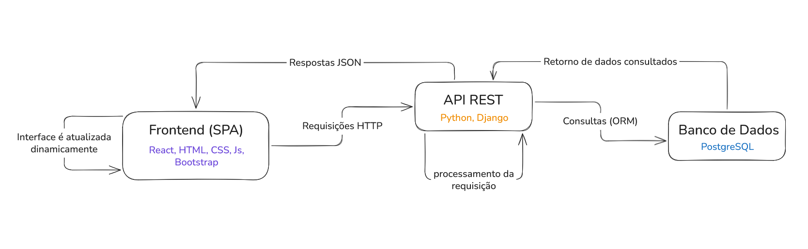
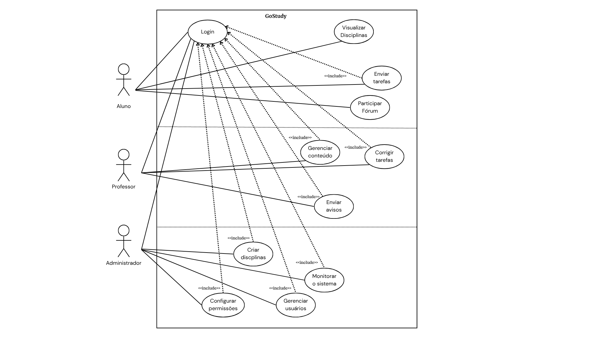
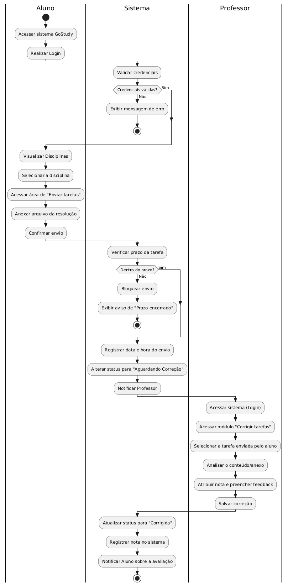
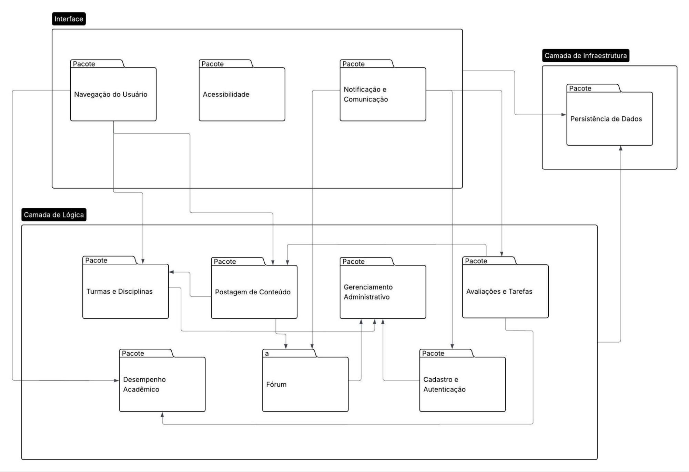
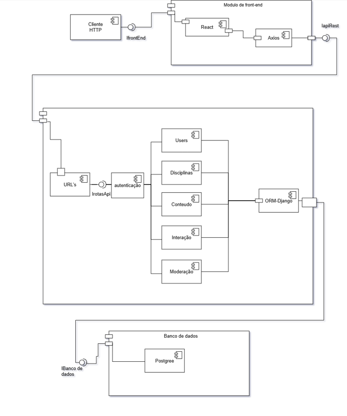
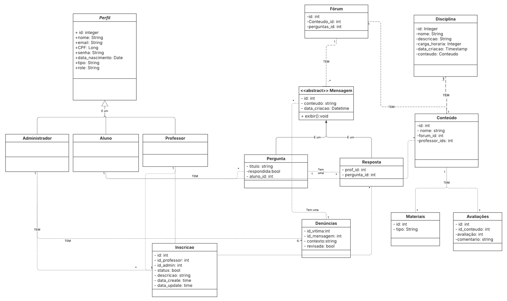
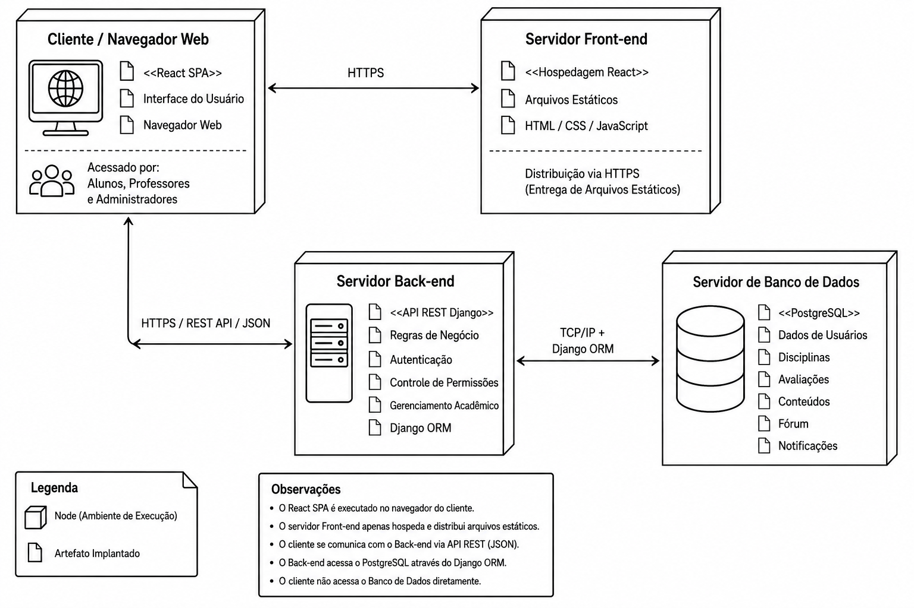

  <a href="assets/files/Documento_de_Arquitetura-Turing (1.0).docx" download="Documento_de_Arquitetura-Turing (1.0).docx" style="display: inline-block; padding: 12px 24px; background-color: #007BFF; color: #ffffff; text-decoration: none; border-radius: 5px; font-weight: bold; font-family: sans-serif; box-shadow: 0 2px 4px rgba(0,0,0,0.2);">
    📥 Baixar Documento de Arquitetura (.docx)
  </a>

# GoStudy

**Documento de Arquitetura**

Versão 1.0

---

**Tabela - Integrantes do Grupo**

| Matrícula | Nome | Função (responsabilidade) | Pontos de participação na elaboração |
| --- | --- | --- | --- |
| 242004706 | Gabriel Vieira Octacilio Pinheiro | P.O | 9.1 |
| 242015989 | Zayra Batista Moraes | Analista de qualidade | 9.1 |
| 242005196 | Arthur Evangelista da Silva | Dev | 9.1 |
| 242004840 | Luana Carvalho de Almeida | Dev | 9.1 |
| 232014370 | Arthur Alves Ribeiro | Analista de qualidade | 9.1 |
| 242015960 | Thiago Henrique Machado de Souza | Dev | 9.1 |
| 241012267 | João Vitor Justo Gonçalves | Dev | 9.1 |
| 242015254 | Luisa de Souza Renhe | Dev | 9.1 |
| 242015915 | Luiz Gustavo da Conceição Souza | Dev | 9.1 |
| 242015791 | Clarice Gitirana Gusson | Dev | 9.1 |
| 242015924 | Maria Eduarda de Jezus Guimarães | P.O | 9.1 |

---

**Histórico de Revisões**

| **Data** | **Versão** | **Descrição** | **Autor(es)** |
| --- | --- | --- | --- |
| **14/05** | 1.0 | Primeira versão do documento | Grupo Turing |

---

## Sumário

- ***1 Introdução*** 
  - **1.1 Propósito** 
  - **1.2 Escopo** 
- ***2 Representação Arquitetural*** 
  - **2.1 Definições** 
  - **2.2 Justificativa.** 
  - **2.3 Detalhamento** 
  - **2.4 Metas e restrições arquiteturais** 
  - **2.5 Visões** 
    - **2.5.1 Visão de uso** 
    - **2.5.2 Visão de organização lógica** 
    - **2.5.3 Visão estrutural** 
    - **2.5.4 Visão de Implantação** 
  - **2.6 Restrições adicionais** 
- ***3 Bibliografia*** 

---

# 1 Introdução

## 1.1 Propósito

Este documento descreve a arquitetura do sistema sendo desenvolvido pelo grupo, na disciplina de MDS-Métodos de Desenvolvimento de Software - edição do primeiro semestre de 2026, para o sistema GoStudy, a fim de fornecer uma visão abrangente do sistema para desenvolvedores, testadores e demais interessados em aspectos relacionados às tecnologias a serem usadas no desenvolvimento.

O propósito deste documento é detalhar as diretrizes arquitetônicas, estruturais e de implantação da plataforma web, esclarecendo como ocorrerá a integração entre os módulos do sistema. Ele servirá como um guia técnico para garantir a escalabilidade, manutenção e comunicação adequada entre o back-end desenvolvido em Django e o front-end em React, utilizando a arquitetura de API REST.

## 1.2 Escopo

O sistema GoStudy é uma plataforma web educacional desenvolvida com o objetivo de apoiar o processo de ensino e aprendizagem por meio de uma aplicação digital estruturada em arquitetura SPA (Single Page Application) integrada a uma API REST.

De forma geral, o escopo do produto contempla:

- Gestão de usuários, com cadastro, autenticação e controle de perfis (Aluno, Professor e Administrador);
- Gerenciamento de turmas e disciplinas, permitindo organização do ambiente acadêmico;
- Publicação e acesso a conteúdos educacionais, realizados por professores e disponibilizados aos alunos;
- Criação e gerenciamento de avaliações e tarefas, incluindo envio de atividades pelos estudantes;
- Acompanhamento de desempenho acadêmico, com visualização de progresso e relatórios;
- Sistema de fórum e comunicação, promovendo interação entre usuários;
- Módulo de notificações, para informar sobre atividades, atualizações e eventos relevantes;
- Recursos de acessibilidade, garantindo inclusão e adaptação da interface para diferentes perfis de usuários.

O sistema será desenvolvido como uma aplicação web responsiva, utilizando React no **frontend**, Django no backend e PostgreSQL para persistência de dados, seguindo o padrão de comunicação via API REST.

Não fazem parte do escopo desta versão inicial funcionalidades que não estejam diretamente relacionadas à operação acadêmica da plataforma, bem como integrações externas complexas não previstas nos documentos de Visão e Declaração de Escopo já entregues.

Em síntese, o escopo do GoStudy compreende o desenvolvimento de uma plataforma educacional modular, segura e escalável, destinada a organizar conteúdos, atividades, comunicação e acompanhamento de desempenho acadêmico dentro de um ambiente web estruturado.

---

# 2 Representação Arquitetural

## 2.1 Definições

O sistema segue uma arquitetura modular em camadas baseada no modelo cliente-servidor, integrada a uma API REST para fazer a comunicação entre o frontend e o backend. Junto a isso, será utilizado o modelo Single Page Application (SPA), permitindo uma navegação dinâmica pelo usuário, sem recarregar a página inteira a cada interação.

A arquitetura separa de forma clara as responsabilidades entre o frontend, o backend e o banco de dados, o que favorece a organização do código e a evolução do sistema.

O frontend será construído com React, HTML, CSS e Bootstrap; o backend com Python e Django; e a persistência de dados será feita com PostgreSQL. Essas tecnologias serão beneficiadas pela escolha arquitetural, onde a comunicação entre o frontend e o backend ocorrerá por meio de requisições HTTP usando REST, enquanto que o backend acessará o banco de dados por meio do Django ORM. Por fim, o versionamento do código será feito pelo Git e Github, tudo sempre com o apoio colaborativo de toda a equipe.

## 2.2 Justificativa

A escolha da arquitetura em SPA API-REST vem da necessidade de que a plataforma seja modular, escalável, acessível e de fácil manutenção, respeitando o trabalho de diversos desenvolvedores ao mesmo tempo e reduzindo conflitos durante esse desenvolvimento colaborativo (conforme definido na seção 1.3 do documento de visão do produto).

O uso do React no Frontend gera uma interface dinâmica e responsiva, fácil de interagir, além da criação de módulos de acessibilidade.

O Backend em Django colabora com a lógica de funcionamento e interação com banco de dados, na autenticação, controles de permissão e regras de funcionamento interno.

O Banco de Dados em PostgreSQL garante a integridade dos dados com tolerância a falhas e persistência deles em todas as interações. Em escalabilidade, permite que vários usuários modifiquem os dados simultaneamente sem bloquear o banco de dados.

As plataformas Git e Github ajudam na organização e gerenciamento das branches e issues definidas para as respectivas funcionalidades completas, facilitando o desenvolvimento.

Cada parte tem suas responsabilidades definidas e bem estruturadas, e a escolha de comunicação (REST API) entre essas partes facilita a modularidade, assim como no momento de testes iterativos e desenvolvimento paralelo, todas características inatas do desenvolvimento ágil e XP definidos anteriormente pelo ciclo de vida (seção 2.1) no documento de visão.

O SPA cria uma melhor experiência de usuário, uma vez que essa permanece mais fluída durante a sua navegação na web.

## 2.3 Detalhamento

A organização arquitetural do sistema foi definida a partir dos perfis de usuários, dos cenários funcionais e seus respectivos requisitos (todas definidas nas seções 4.2 a 4.4 do documento de visão). Com base nessas definições, serão utilizadas três camadas principais para o desenvolvimento, com responsabilidades próprias, componentes e regras de uso:

**Camada frontend:**

Responsabilidades: renderizar interface, navegação, formulários, configurações de acessibilidade, responsividade, comunicação de toda a aplicação com a API.

**Camada backend:**

Responsabilidades: verificação de autenticação, autorização, regras de negócio, endpoints de API, validação de envio de dados, gerenciamento de sessão, lógica geral de integração.

**Camada de banco de dados:**

Responsabilidades: armazenamento de dados e persistência, integridade relacional desses dados, performance, registro de usuário, conteúdo educacional, mensagens, avaliações.

A comunicação entre essas camadas acontece de forma desacoplada e padronizada, onde temos interfaces de interação.

**frontend - backend:** o frontend consome os endpoints disponibilizados pela API REST via requisições HTTP e respostas json.

**backend - banco:** o backend valida essas entradas recebidas pelo front, realiza os procedimentos lógicos necessários e acessa os dados através do django orm. O banco de dados não é acessado diretamente pelo frontend. (isso dá segurança, controle e garantia de que os dados se mantêm íntegros).

A imagem a seguir representa essa organização arquitetural e as interações descritas para sua comunicação padronizada.

*Figura 01: esquema das camadas e interações*

---

## 2.4 Metas e restrições arquiteturais

O sistema adotará uma arquitetura baseada em SPA (Single Page Application) + API REST, separando frontend do backend em aplicações independentes. Essa abordagem foi escolhida por proporcionar maior modularidade, facilidade de manutenção, escalabilidade e melhor experiência para o usuário.

### Metas arquiteturais

- **Desempenho**:
  - O sistema deve responder a 95% das requisições em até 2 segundos;
  - A SPA deve carregar inicialmente em tempo reduzido, priorizando carregamento assíncrono de componentes;
  - A comunicação entre frontend e backend deve minimizar transferências desnecessárias de dados;
  - **Justificativa:** A garantia de fluidez na navegação da aplicação e a melhor experiência para o usuário;

- **Escalabilidade**:
  - O frontend SPA e a API REST devem ser escalados independentemente;
  - A arquitetura deve permitir adição de novos módulos sem impactar significativamente os componentes existentes;
  - **Justificativa:** Facilita crescimento futuro do sistema e distribuição de carga;

- **Manutenibilidade**:
  - O frontend e backend devem possuir responsabilidades bem definidas;
  - A arquitetura deve permitir adição de novos módulos sem impactar significativamente os componentes existentes;
  - **Justificativa:** Facilita o crescimento futuro do sistema e distribuição de carga;

- **Usabilidade**:
  - A navegação entre páginas da SPA deve ocorrer sem recarregamento completo da aplicação;
  - O sistema deve apresentar interface responsiva e intuitiva;
  - **Justificativa:** Melhorar experiência do usuário e reduz tempo de interação;

- **Segurança:**
  - A API REST deve possuir autenticação e autorização;
  - Dados sensíveis devem ser protegidos durante transmissão;
  - O sistema deve validar entradas tanto no frontend quanto no backend;
  - **Justificativa:** Reduz riscos de acesso indevido e vulnerabilidades;

### Restrições arquiteturais

- **SPA + API REST:**
  - O sistema deverá usar uma arquitetura baseada em API REST para comunicação entre backend e frontend, assim toda troca de informações deve ser padronizada através de endpoints HTTP;
  - O frontend não poderá acessar diretamente o banco de dados, dependendo exclusivamente da API.

- **Frontend:**
  - O frontend utilizará o React, então toda a interface da plataforma deverá utilizar componentes construídos com essa tecnologia;
  - A interface deverá ser compatível com diferentes resoluções e dispositivos, além de ser compatível com versões mais recentes dos principais navegadores.

- **Backend:**
  - O backend deverá ser desenvolvido utilizando Python com o framework Django. Toda a lógica do negócio, autenticação, gerenciamento de usuários e integração de dados será baseado nessas tecnologias;
  - Separação clara entre regras de negócio e acesso a dados;
  - Os serviços principais da plataforma deverão permanecer disponíveis continuamente.

- **Padrão API:**
  - A API deve seguir o padrão RESTful;
  - Endpoints devem utilizar substantivos no plural:
    - `GET /usuarios/{id}`, `POST /usuarios`
  - As respostas devem utilizar JSON;
  - Códigos HTTP apropriados devem ser utilizados;

- **BD:**
  - O sistema deverá utilizar o Postgres para persistência dos dados; todos os dados acadêmicos, autenticações e conteúdos públicos serão persistidos nele;
  - Alterações estruturais devem ser feitas por migrations;

- **Padrão de codificação:**
  - O código-fonte deverá seguir um padrão único de organização e nomenclatura:
    - Nome de classe: `PascalCase`
    - Nome de atributo/métodos: `snake_case`

- **Controle de versão:**
  - O desenvolvimento e controle de versão deve ser restringido ao Github, organizado em branches e integrado com Pull Requests revisados, sendo integrado na branch principal apenas após validação.

- **Testes:**
  - O backend deve possuir testes unitários para regras de negócio;
  - O frontend deve possuir testes de componentes críticos;
  - Novas funcionalidades somente serão integradas após validação por meio de testes unitários.

- **Segurança:**
  - Senhas deverão ser obrigatoriamente armazenadas utilizando criptografia/hash seguro, assim garantindo que as credenciais permaneçam seguras.

---

## 2.5 Visões

As visões de arquitetura representam diferentes perspectivas utilizadas para descrever e compreender um sistema de software de forma organizada e completa. A visão de uso define o escopo do sistema e demonstra como os usuários interagem com suas funcionalidades. A visão organizacional lógica apresenta a divisão da arquitetura em camadas, módulos ou responsabilidades, evidenciando a separação entre componentes como interface, regras de negócio e persistência de dados. A visão estrutural descreve a composição interna do sistema e os relacionamentos entre suas partes, permitindo entender como os componentes se conectam e colaboram entre si. Por fim, a visão de implantação mostra o ambiente onde o sistema será executado, incluindo servidores, bancos de dados, serviços e infraestrutura necessários para o funcionamento da aplicação. Para melhor entendimento do nosso trabalho especificamos cada uma das visões nas sessões abaixo.

### 2.5.1 Visão de uso

O escopo do GoStudy consiste em uma plataforma web integrada de estudos voltada para estudantes do ensino médio.

Seu objetivo central é organizar a rotina acadêmica através de trilhas de aprendizagem estruturadas, ferramentas de gestão de tempo e um ambiente de interação colaborativa.

O sistema gerencia três perfis distintos:

- **Alunos**: Acessam conteúdos, participam de fóruns e monitoram seu desempenho.
- **Professores**: Realizam a postagem de materiais didáticos, avaliações e respondem a dúvidas.
- **Administradores**: Gerenciam perfis, homologam currículos de professores, administram denúncias e mantêm as disciplinas/turmas.

A plataforma foca na acessibilidade e na centralização de recursos pedagógicos para reduzir a desorganização do aprendizado individual.

*Figura 02: Diagrama de Casos de Uso.*

*Figura 03: Diagrama de Atividades.*

Optamos por uma arquitetura em Django, pois ela atende de forma eficiente aos requisitos de processamento e estruturação do sistema. Além disso, a adoção do Python se alinha aos conhecimentos técnicos da equipe, o que garante uma sintaxe limpa, minimiza os riscos de implementação e agiliza o desenvolvimento do projeto.

### 2.5.2 Visão de organização lógica

O sistema é subdividido nos seguintes módulos:

1. Cadastro e Autenticação;
2. Gerenciamento Administrativo;
3. Navegação do usuário;
4. Turmas e Disciplinas;
5. Postagem de conteúdo;
6. Avaliações e tarefas;
7. Desempenho acadêmico;
8.  Notificação e comunicação;
9. Fórum;
10. Acessibilidade;
11. Persistência de Dados.

---

1. **Cadastro e Autenticação:**

Este módulo é responsável pelo gerenciamento de acesso ao sistema, permitindo o cadastro e autenticação dos usuários (Aluno, Professor e Administrador). É necessário para garantir segurança, controle de permissões e identificação correta dos perfis.

Além disso, ele implementa regras de criptografia de senha, autenticação de login e persistência segura de dados dos usuários.

Este módulo se comunica com:
  - Banco de Dados → armazenamento dos dados dos usuários;
  - Módulo Administrativo → validação de professores;
  - Módulo de Disciplinas → controle de permissões;
  - Módulo de Fórum → identificação do autor das mensagens.

Interfaces:
  - Tela de Login;
  - Tela de Cadastro de Aluno;
  - Tela de Cadastro de Professor;
  - API REST de autenticação;
  - Middleware de autenticação JWT/Session.

---

2. **Gerenciamento administrativo:**

O módulo administrativo centraliza o gerenciamento global do sistema. Ele é responsável pela manutenção de usuários, análise de denúncias, homologação de professores e gerenciamento das disciplinas. Existindo para garantir uma boa organização e assistência para a plataforma.

Comunica-se com:
  - Módulo de Cadastro → gerenciamento de contas;
  - Módulo de Fórum → recebimento de denúncias;
  - Módulo de Disciplinas → criação e remoção de disciplinas;
  - Banco de Dados → persistência das alterações.

Interfaces:
  - Painel administrativo;
  - Tela de gerenciamento de usuários;
  - Tela de denúncias;
  - API administrativa.

---

3. **Navegação do usuário:**

Este módulo organiza a experiência do aluno dentro da plataforma, permitindo navegação entre disciplinas, conteúdos e atividades. Sua lógica é proporcionar acessibilidade, organização e facilidade de uso.

Comunica-se com:
  - Módulo de Disciplinas;
  - Módulo de Conteúdo;
  - Módulo de Desempenho;
  - Banco de Dados.

Interfaces:
  - Dashboard do aluno;
  - Página de disciplinas;
  - Página de conteúdos.

---

4. **Turmas e Disciplinas:**

Responsável pela criação, organização e gerenciamento das disciplinas e turmas disponíveis no sistema. Sua lógica é estruturar o ambiente educacional da plataforma, permitindo a separação dos conteúdos por áreas de ensino e organização acadêmica.

Comunica-se com:
  - Módulo Administrativo → manutenção das disciplinas;
  - Módulo de Conteúdo → associação de materiais;
  - Módulo de Navegação → exibição das disciplinas aos alunos;
  - Banco de Dados → armazenamento das turmas.

Interfaces:
  - Tela de gerenciamento de disciplinas;
  - Tela de inscrição em disciplinas;
  - API de disciplinas.

---

5. **Postagem de Conteúdo:**

Permite que professores publiquem materiais didáticos, links, exercícios e conteúdos de apoio. A lógica deste módulo é centralizar o compartilhamento de conhecimento e garantir organização pedagógica dentro das respectivas disciplinas.

Comunica-se com:
  - Módulo de Disciplinas → vinculação do conteúdo;
  - Módulo de Fórum → criação automática de fóruns por postagem;
  - Módulo de Avaliações → associação de atividades;
  - Banco de Dados → armazenamento dos conteúdos.

Interfaces:
  - Tela de postagem;
  - Editor de conteúdo;
  - API de upload/publicação.

---

6. **Avaliações e Tarefas:**

Responsável pela criação, envio e correção de avaliações e tarefas acadêmicas. Sua função lógica é permitir o acompanhamento do aprendizado e avaliação do desempenho dos estudantes.

Comunica-se com:
  - Módulo de Conteúdo → vínculo com disciplinas;
  - Módulo de Desempenho → cálculo de progresso;
  - Banco de Dados → armazenamento de respostas.

Interfaces:
  - Tela de criação de avaliações;
  - Tela de submissão de tarefas;
  - API de avaliações.

---

7. **Desempenho acadêmico:**

Responsável por monitorar o progresso individual e coletivo dos estudantes. A lógica deste módulo é fornecer feedback acadêmico para alunos individualmente quanto o feedback sobre a turma para os professores.

Comunica-se com:
  - Módulo de Avaliações;
  - Módulo de Navegação;
  - Banco de Dados.

Interfaces:
  - Painel de desempenho do aluno;
  - Relatórios de turma;
  - API de métricas acadêmicas.

---

8. **Notificação e comunicação:**

Responsável pelo envio de e-mails e notificações automáticas do sistema. Sua função lógica é manter usuários informados sobre atividades, respostas e aprovações.

Comunica-se com:
  - Fórum;
  - Cadastro;
  - Avaliações;
  - Banco de Dados.

Interfaces:
  - Serviço de e-mail;
  - APIs SMTP;
  - Sistema interno de notificações.

---

9. **Fórum:**

Permite comunicação entre alunos e professores através de perguntas, respostas e denúncias. Sua função lógica é incentivar interação colaborativa e suporte pedagógico contínuo.

Comunica-se com:
  - Módulo de Conteúdo;
  - Módulo Administrativo;
  - Módulo de Notificações;
  - Banco de Dados.

Interfaces:
  - Fórum de dúvidas;
  - Sistema de respostas;
  - Tela de denúncias.

---

10. **Acessibilidade:**

Implementa recursos de inclusão digital, como alteração de fontes, contraste e modos adaptados para daltonismo e autismo. Sua lógica é garantir acessibilidade e inclusão para diferentes perfis de usuários.

Comunica-se com:
  - Interface do Front-end;
  - Configurações do usuário;
  - Banco de Dados.

Interfaces:
  - Painel de acessibilidade;
  - Configurações visuais do sistema.

---

11. **Persistência de Dados:**

Responsável pela manipulação, armazenamento e recuperação das informações da plataforma. Sua lógica é garantir integridade, persistência e segurança dos dados.

Comunica-se com todos os módulos através da API REST e ORM do Django.

Interfaces:
  - PostgreSQL;
  - ORM Django;
  - Serviços de persistência.

---

*Figura 04: **Diagrama de Pacotes.***

### 2.5.3 Visão estrutural

A plataforma GoStudy será organizada utilizando arquitetura cliente-servidor baseada em API REST. O sistema será dividido em 3 camadas principais:

- Frontend
- Backend
- Banco de dados

*Figura 05: Diagrama de componentes.*

*Figura 06: Diagrama de Classes.*

### 2.5.4 Visão de Implantação

A visão de implantação descreve o ambiente em que o sistema GoStudy será executado, apresentando como os componentes da aplicação serão distribuídos na infraestrutura computacional e como ocorrerá a comunicação entre eles. Essa visão permite compreender a organização dos serviços, os protocolos utilizados e as tecnologias responsáveis pela execução da plataforma.

O sistema será implantado utilizando uma infraestrutura baseada em computação em nuvem (Cloud Computing), adotando serviços do tipo PaaS (Platform as a Service) e/ou IaaS (Infrastructure as a Service). A escolha desse modelo se justifica pela necessidade de garantir disponibilidade contínua da plataforma, facilidade de manutenção e possibilidade de escalabilidade conforme o aumento da quantidade de usuários simultâneos acessando o sistema.

A arquitetura de implantação seguirá o modelo SPA + API REST definido anteriormente, mantendo a separação entre frontend, backend e persistência de dados. Essa divisão reduz o acoplamento entre os componentes e facilita o desenvolvimento paralelo, manutenção e evolução futura do sistema.

O ambiente será composto por quatro principais nós de implantação.

**Cliente / Navegador Web**

O primeiro nó representa o ambiente do usuário final, onde alunos, professores e administradores acessam a plataforma através de navegadores web em computadores, tablets ou dispositivos móveis.

Nesse ambiente será executada a interface da aplicação desenvolvida em React. A utilização do modelo SPA (Single Page Application) permite uma navegação mais dinâmica e fluida, reduzindo carregamentos completos de página e melhorando a experiência do usuário durante a utilização da plataforma.

Além da renderização das telas, o navegador também será responsável por realizar as requisições HTTP para a API REST do sistema, enviando e recebendo dados em formato JSON.

**Servidor Front-end**

O servidor front-end será responsável pela hospedagem e distribuição dos arquivos estáticos da aplicação React, incluindo arquivos HTML, CSS, JavaScript e demais recursos visuais da interface.

A separação do frontend em um servidor próprio facilita a manutenção da interface e permite que essa camada seja escalada independentemente do backend. Além disso, esse modelo favorece o uso de serviços de CDN (Content Delivery Network), melhorando o tempo de carregamento das páginas e reduzindo atrasos de acesso para os usuários.

A comunicação entre o navegador e o servidor front-end ocorre através do protocolo HTTPS, garantindo maior segurança na transmissão dos dados.

**Servidor Back-end**

O servidor backend será responsável pela execução da API REST desenvolvida em Python utilizando o framework Django. Nesse ambiente estarão concentradas as regras de negócio da aplicação, autenticação de usuários, gerenciamento de permissões, validação de dados, controle das disciplinas, avaliações, conteúdos acadêmicos e demais funcionalidades centrais da plataforma.

A utilização do Django contribui para uma melhor organização da aplicação, além de fornecer recursos integrados relacionados à segurança, autenticação e comunicação com banco de dados.

A comunicação entre frontend e backend ocorre por meio de requisições HTTP utilizando padrão REST, com troca de informações em formato JSON. Essa separação entre interface e lógica de negócio reduz dependências entre as camadas do sistema e facilita futuras expansões da aplicação.

**Servidor de Banco de Dados**

O armazenamento persistente das informações será realizado em um servidor dedicado ao PostgreSQL, utilizado como Sistema Gerenciador de Banco de Dados Relacional (SGBDR).

A escolha do PostgreSQL se justifica pela robustez, confiabilidade e capacidade de lidar com múltiplos acessos simultâneos, característica importante para uma plataforma educacional com diversos usuários conectados ao mesmo tempo. Além disso, o banco oferece integridade relacional dos dados e boa integração com o Django ORM utilizado no backend.

Nesse ambiente serão armazenados dados relacionados aos usuários, disciplinas, conteúdos, avaliações, notificações, mensagens do fórum e demais informações da plataforma.

O banco de dados não será acessado diretamente pelo frontend. Toda comunicação ocorrerá exclusivamente através do backend, garantindo maior segurança, controle de permissões e integridade dos dados manipulados pelo sistema.

**Diagrama de Implementação**

O diagrama de implementação representa os nós físicos e lógicos do sistema, bem como os protocolos de comunicação utilizados entre os componentes.

*Figura 07: Diagrama de implementação do Sistema GoStudy*

A figura 07 apresenta a visão de implantação do GoStudy, mostrando como os componentes do sistema são distribuídos e como ocorre a comunicação entre eles.

O nó **Cliente / Navegador Web** representa os usuários acessando a plataforma pelo navegador, onde a aplicação React SPA é executada. O **Servidor Front-end** é responsável por hospedar e distribuir os arquivos da interface web via HTTPS.

O **Servidor Back-end** hospeda a API REST desenvolvida em Django, responsável pelas regras de negócio, autenticação e gerenciamento das funcionalidades da plataforma. Já o **Servidor de Banco de Dados** utiliza PostgreSQL para armazenar os dados do sistema, como usuários, disciplinas, conteúdos e avaliações.

A comunicação ocorre de forma segura: o cliente se conecta ao backend utilizando HTTPS e REST API, enquanto o backend acessa o banco de dados através do Django ORM via TCP/IP. O banco de dados não é acessado diretamente pelo cliente, garantindo maior segurança e controle das informações.

---

## 2.6 Restrições adicionais

O desenvolvimento do GoStudy está sujeito a um conjunto de restrições que orientam tanto as decisões técnicas quanto os aspectos de negócio da plataforma. Essas restrições foram definidas com base nas características do público-alvo, na natureza do sistema e nos requisitos de qualidade estabelecidos pela equipe:

**Restrições de negócio**

A plataforma GoStudy é acessível diretamente pela internet, sem necessidade de vínculo institucional ou rede privada, o que é fundamental para garantir o acesso democrático aos estudantes da rede pública. No entanto, o uso completo da plataforma exige cadastro e autenticação do usuário, uma vez que o sistema opera com três perfis distintos: Administrador, Professor e Aluno, cada um com permissões e funcionalidades específicas. O módulo de cadastro deve estar disponível 24 horas por dia, 7 dias por semana, permitindo que novos usuários se registrem a qualquer momento.

**Características de qualidade**

- **Usabilidade:** Por atender a um público amplo e heterogêneo, que inclui estudantes de diferentes faixas etárias e níveis de familiaridade com tecnologia, a plataforma deve apresentar uma interface intuitiva e de fácil navegação. O sistema deve ser compreensível mesmo por usuários leigos, sem necessidade de treinamento prévio. Essa característica é considerada essencial para que o GoStudy cumpra seu objetivo de democratizar o acesso à educação.

- **Disponibilidade:** O sistema deve estar disponível de forma contínua, especialmente o módulo de cadastro e acesso a conteúdos, dado que os estudantes podem acessar a plataforma em diferentes horários do dia. Interrupções prolongadas comprometem diretamente a experiência de aprendizagem e a confiança dos usuários na ferramenta.

- **Confiabilidade:** O GoStudy deve garantir o funcionamento correto e estável de suas funcionalidades principais: como login, acesso a disciplinas, postagem e visualização de conteúdos, minimizando falhas e comportamentos inesperados. A confiabilidade é especialmente crítica para os professores, que dependem da plataforma para disponibilizar materiais aos alunos.

- **Portabilidade:** A plataforma deve funcionar corretamente nos principais navegadores do mercado e ser responsiva para diferentes dispositivos, incluindo computadores, tablets e smartphones. Essa restrição é justificada pelo perfil do público-alvo, que frequentemente acessa conteúdos digitais por meio de celulares.

- **Segurança:** Dado que a plataforma armazena dados pessoais dos usuários como nome, e-mail, CPF e data de nascimento, a segurança é uma restrição de alta prioridade. Os dados sensíveis, em especial senhas, devem ser armazenados com criptografia adequada. Além disso, o sistema deve garantir que cada perfil de usuário acesse exclusivamente as funcionalidades a ele atribuídas, conforme descrito a seguir:

  - O **Administrador** possui acesso total à plataforma, podendo criar, editar e remover qualquer perfil, homologar cadastros de professores, analisar denúncias e gerenciar turmas e disciplinas. Por concentrar o maior nível de privilégio, sua conta deve ser protegida com credenciais seguras e não deve ser acessível por outros perfis.

  - O **Professor** tem acesso restrito às funcionalidades de gestão de sua disciplina, podendo postar conteúdos, criar avaliações e interagir com alunos no fórum de dúvidas. Seu cadastro só é efetivado após aprovação do currículo pelo Administrador, o que representa uma camada adicional de controle de acesso.

  - O **Aluno** tem acesso às funcionalidades de consumo de conteúdo, podendo se inscrever em disciplinas, visualizar materiais e enviar respostas a avaliações. Não possui permissão para acessar áreas administrativas ou de gerenciamento de conteúdo.

Essa separação de permissões está alinhada à legislação brasileira de proteção de dados (LGPD), que exige que os sistemas garantam o acesso às informações pessoais apenas por quem tem necessidade legítima de consultá-las.

---

# 3 Bibliografia

KRUTCHEN, Philippe. *Architectural Blueprints: The 4+1 View Model of Software Architecture*. Disponível em: [arXiv](https://arxiv.org/abs/2006.04975). Acesso em: 14 maio 2026.

TURING – GoStudy. *Visão do Produto e do Projeto*. Versão 1.0. Brasília: Projeto GoStudy, 2026. 30 p.

---

