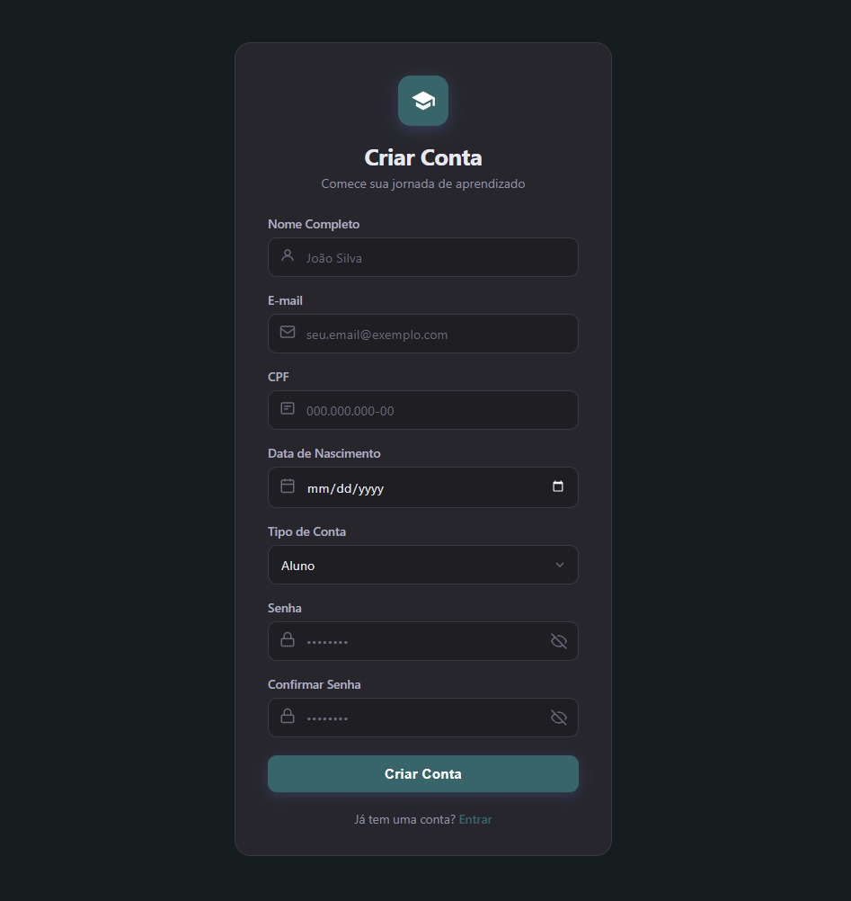

# Sprint 1 — Cadastro de Usuários

**Período:** 10/05 - 19/05/2026  
**Objetivo:** Implementar autenticação e CRUD geral de todos os usuários.

---

## O que foi feito

### Backend
- CRUD completo de alunos, professores e administradores
- Sistema de autenticação com JWT
- Lógica de permissões por perfil

### Banco de dados
- Modelagem das entidades de usuários: `Perfil`, `Aluno`, `Professor`, `Admin`
- `Perfil` usando `AbstractBaseUser` com autenticação por email

### Frontend
- Tela de login
- Tela de cadastro de conta (nome completo, email, CPF, data de nascimento, tipo de conta, senha)

---

## Banco de dados

| Entidade | Campos principais |
|----------|-------------------|
| `Perfil` | `email` (único), `nome`, `cpf`, `data_nascimento`, `tipo`, `is_active` |
| `Aluno` | `perfil` (OneToOne → Perfil) |
| `Professor` | `perfil` (OneToOne → Perfil), `curriculo` (FileField) |
| `Admin` | `perfil` (OneToOne → Perfil) |

---

## Endpoints disponíveis

| Método | Endpoint | Descrição |
|--------|----------|-----------|
| POST | `/api/usuarios/alunos/` | Cadastro de aluno |
| POST | `/api/usuarios/professores/` | Cadastro de professor |
| GET | `/api/usuarios/professores/` | Listagem de professores |
| POST | `/api/usuarios/login/` | Login — retorna JWT |
| POST | `/api/usuarios/login/refresh/` | Refresh do token JWT |

---

## Telas

{ width="500" }    { width="525" }