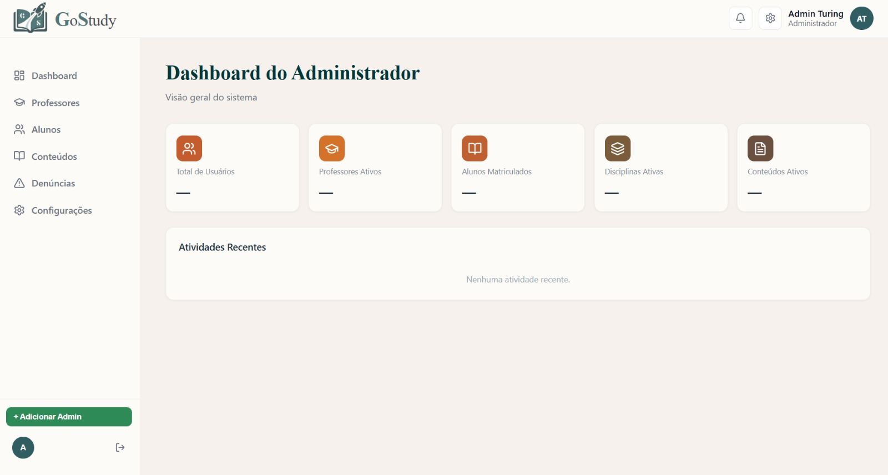

# Sprint 2 — Administração

**Período:** 19/05 - 28/05/2026  
**Objetivo:** Implementar o módulo de gerenciamento administrativo e o processo seletivo de professores.

---

## O que foi feito

### Backend
- Módulo de gerenciamento de perfis com CRUD completo
- Lógica para métodos especiais de administrador
- PS de professores — apenas administradores podem aprovar a criação do perfil professor pela análise do currículo
- Lógica para cadastro e aprovação de inscrições de professores
- Implementação de comando para criar admin seed via terminal

### Banco de dados
- Reformulação completa do banco — remoção da entidade `Turma`
- Criação dos models `Conteudo` e `Material`
- Atualização da `Matricula` — FK trocada de `Turma` para `Conteudo`
- `Inscricao` com campos de auditoria (`analisado_por`, `analisado_em`)
- `Denuncia` atualizada com campos de evidências, motivo e parecer do admin

### Frontend
- Dashboard do administrador
- Painel de gerenciamento de professores e alunos
- Tela de aprovação de currículos (TeacherReview)
- Sidebar de navegação administrativa

---

## Banco de dados

| Entidade | Campos principais |
|----------|-------------------|
| `Conteudo` | `disciplina` (FK), `professores` (M2M), `nome`, `descricao`, `status` |
| `Material` | `conteudo` (FK), `nome`, `tipo`, `arquivo`, `link` |
| `Matricula` | `aluno` (FK), `conteudo` (FK), `matriculado_em` |
| `Inscricao` | `professor` (FK), `status`, `analisado_por`, `analisado_em` |

---

## Endpoints disponíveis

| Método | Endpoint | Descrição |
|--------|----------|-----------|
| GET | `/api/interacoes/inscricoes/` | Lista inscrições de professores |
| GET | `/api/interacoes/inscricoes/?status=pendente` | Filtra inscrições pendentes |
| PATCH | `/api/interacoes/inscricoes/{id}/aprovar/` | Aprova inscrição |
| PATCH | `/api/interacoes/inscricoes/{id}/rejeitar/` | Rejeita inscrição |
| POST | `/api/usuarios/professores/create_by_admin/` | Cria professor diretamente via admin |

---

## Telas

### Dashboard do Administrador
{ width="900" }