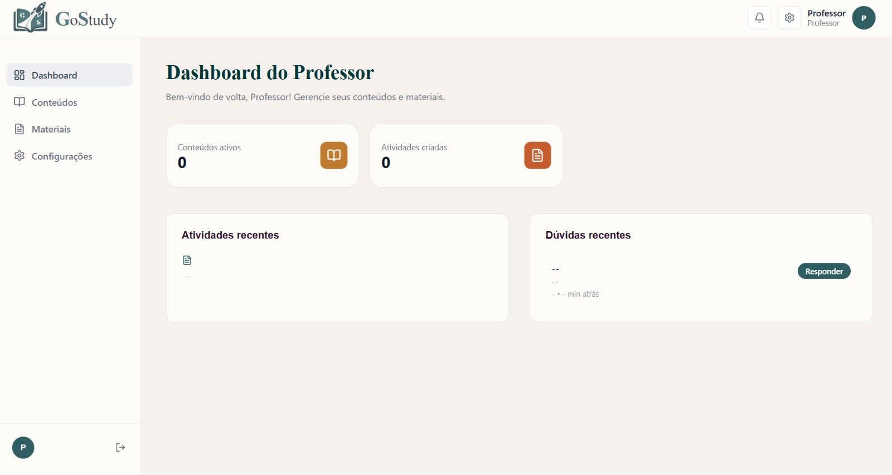

# Sprint 3 — Postagem de Material

**Período:** 28/05 - 06/06/2026  
**Objetivo:** Implementar disciplinas, conteúdos, materiais e matrículas relacionadas aos usuários.

---

## O que foi feito

### Backend
- CRUD de disciplinas pelo administrador
- CRUD de conteúdos vinculados a disciplinas
- Postagem de materiais pelo professor por disciplinas criadas
- Validação de tipo de arquivo (PDF, vídeo, imagem, link, apresentação, documento)
- Filtros de materiais por conteúdo e disciplina
- Controle de acesso por perfil — admin gerencia, professor posta, aluno visualiza
- Validação de professor aprovado ao vincular a um conteúdo
- Endpoint de conteúdos de uma disciplina: `GET /api/disciplinas/{id}/conteudos/`
- Filtro de conteúdos por disciplina: `GET /api/disciplinas/conteudos/?disciplina={id}`

### Banco de dados
- `Disciplina` com validação de nome único
- `Conteudo` com `status` (ativo/encerrado)
- `Material` com choices de tipo e validações de arquivo/link
- Substituição de `Pergunta` e `Resposta` por `Forum` e `Mensagem`
- `Forum` criado automaticamente via Django signal quando um conteúdo é criado
- `Mensagem` com hierarquia via `resposta_para` (FK para si mesma)
- `Denuncia` atualizada para referenciar `Mensagem`

### Frontend
- Dashboard do professor com conteúdos ativos e dúvidas recentes
- Página de conteúdos do professor
- Página de materiais do professor com criação de materiais

---

## Banco de dados

| Entidade | Campos principais |
|----------|-------------------|
| `Disciplina` | `nome` (único), `descricao` |
| `Conteudo` | `disciplina` (FK), `professores` (M2M), `nome` (único), `status` |
| `Material` | `conteudo` (FK), `nome`, `tipo`, `arquivo`, `link` |
| `Forum` | `conteudo` (OneToOne) |
| `Mensagem` | `forum` (FK), `autor` (FK), `resposta_para` (FK self), `texto` |

---

## Endpoints disponíveis

| Método | Endpoint | Descrição |
|--------|----------|-----------|
| GET/POST | `/api/disciplinas/` | Lista e cria disciplinas |
| GET/POST | `/api/disciplinas/conteudos/` | Lista e cria conteúdos |
| GET | `/api/disciplinas/{id}/conteudos/` | Conteúdos de uma disciplina |
| GET | `/api/disciplinas/conteudos/?disciplina={id}` | Filtra conteúdos por disciplina |
| GET/POST | `/api/disciplinas/materiais/` | Lista e cria materiais |
| GET | `/api/disciplinas/materiais/?conteudo={id}` | Materiais de um conteúdo |
| GET/POST | `/api/interacoes/foruns/` | Lista fóruns |
| GET/POST | `/api/interacoes/mensagens/` | Lista e envia mensagens |
| GET | `/api/interacoes/mensagens/?forum={id}` | Mensagens de um fórum |
| GET | `/api/interacoes/mensagens/pendentes/` | Perguntas pendentes do professor |

---

## Telas

### Dashboard do Professor
{ width="900" }