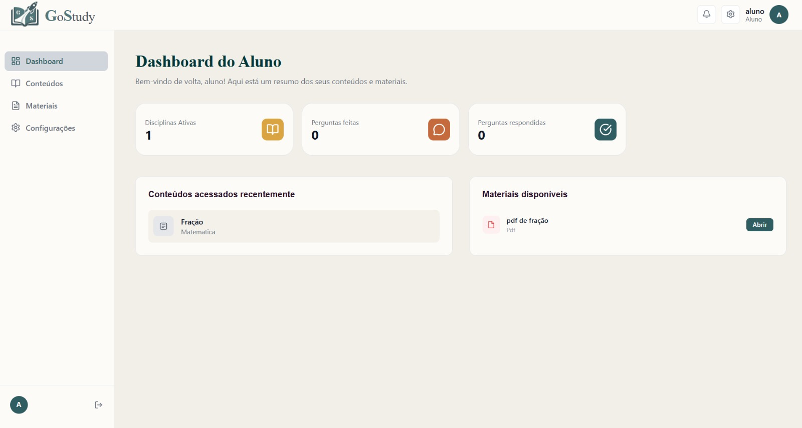
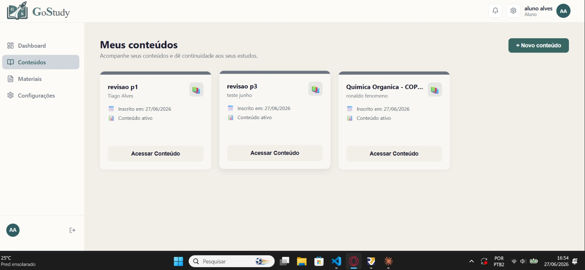
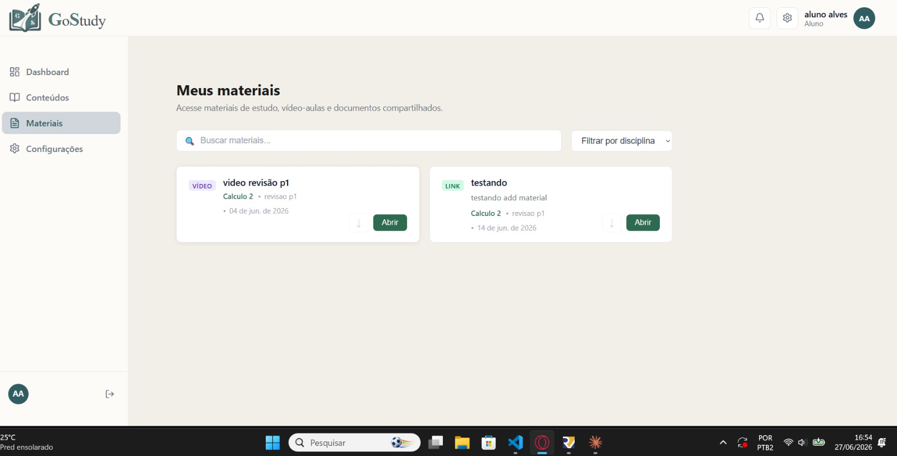

# Sprint 4 — Visualização e Interação

**Período:** 06/06 - 15/06/2026  
**Objetivo:** Implementar a lógica de visualização e acesso para o perfil de aluno.

---

## O que foi feito

### Backend
- Lógica de visualização e acesso com permissões por perfil
- Navegação e matrícula de alunos em conteúdos sem limite máximo
- Visualização dos materiais do conteúdo após matrícula
- Endpoint de conteúdos disponíveis para matrícula: `GET /api/disciplinas/conteudos/disponiveis/`
- Endpoint para servir arquivos PDF inline: `GET /media-inline/<caminho>/`

### Frontend
- Dashboard do aluno com conteúdos acessados recentemente e materiais disponíveis
- Página de conteúdos do aluno — meus conteúdos e explorar novos
- Página de materiais do aluno
- Visualização de conteúdo específico com fórum integrado

---

## Endpoints disponíveis

| Método | Endpoint | Descrição |
|--------|----------|-----------|
| GET | `/api/disciplinas/conteudos/` | Conteúdos em que o aluno está matriculado |
| GET | `/api/disciplinas/conteudos/disponiveis/` | Conteúdos disponíveis para matrícula |
| GET/POST | `/api/matriculas/` | Lista matrículas e realiza nova matrícula |
| DELETE | `/api/matriculas/{id}/` | Cancela matrícula |
| GET | `/media-inline/<caminho>/` | Serve arquivos PDF inline no browser |

---

## Regras de acesso por perfil

| Perfil | Conteúdos visíveis | Materiais visíveis |
|--------|-------------------|-------------------|
| Admin | Todos | Todos |
| Professor | Conteúdos que ministra | Materiais dos seus conteúdos |
| Aluno | Conteúdos em que está matriculado | Materiais dos conteúdos matriculados |

---

## Telas

### Dashboard do Aluno
{ width="900" }

### Tela de Conteúdos do Aluno
{ width="900" }

### Tela de Materiais do Aluno
{ width="900" }