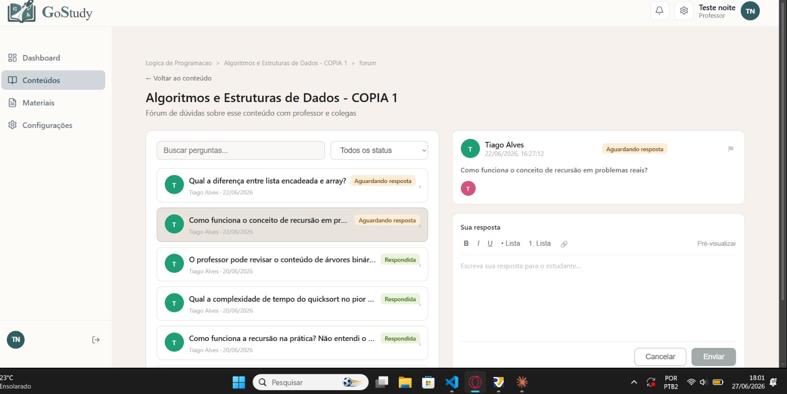
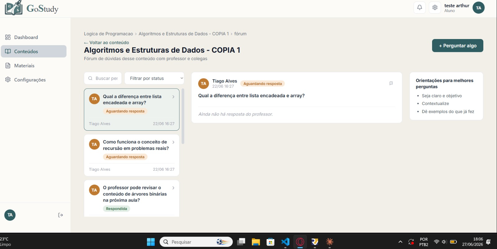
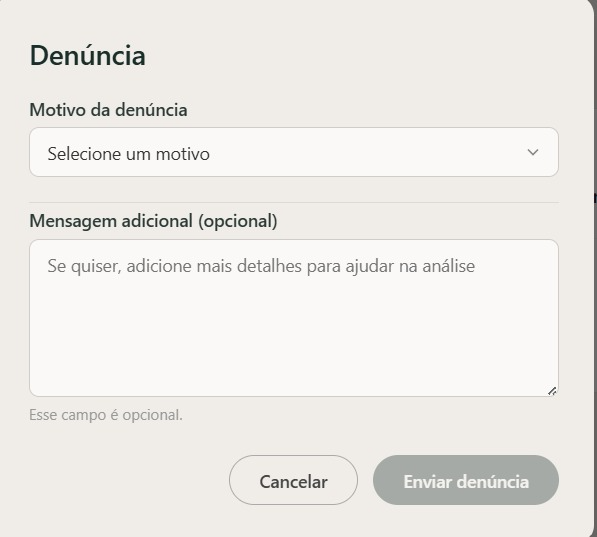

# Sprint 5 — Fórum

**Período:** 15/06 - 24/06/2026  
**Objetivo:** Implementar o sistema completo de fórum de dúvidas por conteúdo.

---

## O que foi feito

### Backend
- Sistema de fórum com hierarquia de mensagens
- Controle de acesso por perfil no fórum
- Endpoint de perguntas pendentes para professores
- Sistema de denúncias de mensagens
- Bloqueio de edição/deleção de mensagem quando há denúncia pendente
- Apenas o autor pode editar ou deletar sua mensagem
- Apenas professores podem responder mensagens (`resposta_para`)
- Validação de mensagem vazia

### Frontend
- Página de fórum do professor com perguntas pendentes
- Página de fórum do aluno com envio de mensagens
- Modal de denúncia de mensagens
- Modal de perguntas no fórum

---

## Banco de dados

| Entidade | Campos principais |
|----------|-------------------|
| `Forum` | `conteudo` (OneToOne) — criado automaticamente ao criar conteúdo |
| `Mensagem` | `forum` (FK), `autor` (FK), `resposta_para` (FK self), `texto` |
| `Denuncia` | `mensagem` (FK), `denunciante`, `denunciado`, `motivo`, `evidencias`, `parecer_admin`, `status` |

---

## Endpoints disponíveis

| Método | Endpoint | Descrição |
|--------|----------|-----------|
| GET | `/api/interacoes/foruns/` | Lista fóruns acessíveis ao usuário |
| GET | `/api/interacoes/foruns/{id}/` | Detalhes de um fórum |
| GET/POST | `/api/interacoes/mensagens/` | Lista e envia mensagens |
| GET | `/api/interacoes/mensagens/?forum={id}` | Mensagens de um fórum específico |
| GET | `/api/interacoes/mensagens/pendentes/` | Perguntas sem resposta do professor |
| PATCH | `/api/interacoes/mensagens/{id}/` | Edita mensagem (apenas autor) |
| DELETE | `/api/interacoes/mensagens/{id}/` | Deleta mensagem (apenas autor, sem denúncia pendente) |

---

## Regras de acesso ao fórum

| Perfil | Fóruns visíveis | Pode enviar mensagem | Pode responder |
|--------|----------------|----------------------|----------------|
| Admin | Todos | Sim | Sim |
| Professor | Conteúdos que ministra | Sim | Sim |
| Aluno | Conteúdos matriculados | Sim | Não |

## Telas

### Fórum do Professor
{ width="1000" }

### Fórum do Aluno
{ width="1000" }

### Tela de Denúncia
{ width="500" }