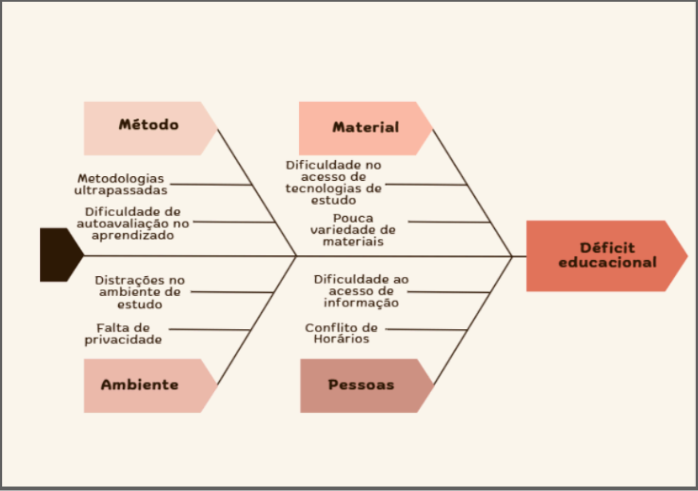
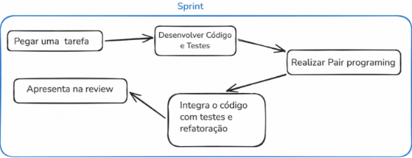
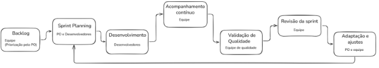

  <a href="assets/files/Visao_do_Produto_e_Projeto_Escopo-Turing (1.1).docx" download="Visao_do_Produto_e_Projeto.docx" style="display: inline-block; padding: 12px 24px; background-color: #007BFF; color: #ffffff; text-decoration: none; border-radius: 5px; font-weight: bold; font-family: sans-serif; box-shadow: 0 2px 4px rgba(0,0,0,0.2);">
    📥 Baixar Documento de Visão (.docx)
  </a>

<h2>
<strong>Turing-GoStudy
</strong>
</h2>

<h2>
<strong>Visão do Produto e Projeto - Escopo</strong>
</h2>

<strong>Versão [1.1]</strong>

 

| Matrícula | Nome | Função (responsabilidade) | Pontos de participação |
|-----------|------|---------------------------|------------------------|
| 242004706 | Gabriel Vieira Octacilio Pinheiro | P.O | 9.1 |
| 242015915 | Luiz Gustavo da Conceição Souza | Desenvolvedor | 9.1 |
| 232014370 | Arthur Alves Ribeiro | Analista de qualidade | 9.1 |
| 242015791 | Clarice Gitirana Gusson | Desenvolvedora | 9.1 |
| 242015254 | Luísa de Souza Renhe | Desenvolvedora | 9.1 |
| 242015924 | Maria Eduarda de Jezus Guimarães | P.O | 9.1 |
| 242015989 | Zayra Batista Moraes | Analista de qualidade | 9.1 |
| 242015960 | Thiago Henrique Machado de Souza | Desenvolvedor | 9.1 |
| 242005196 | Arthur Evangelista da Silva | Desenvolvedor | 9.1 |
| 241012267 | João Vitor Justo Gonçalves | Desenvolvedor | 9.1 |
| 242004840 | Luana Carvalho de Almeida | Desenvolvedor | 9.1 |
---

 <i>Tabela 1: Integrantes do Grupo.</i>

## Histórico de Revisões

| Data | Versão | Descrição | Autor |
|------|--------|-----------|-------|
| 30/04/2026 | 1.0 | Versão inicial do projeto | Gabriel Vieira |
| 13/05/2026 | 1.1 | Refinamento do escopo do produto (foco no Ensino Médio), alteração da abordagem de testes (substituição de TDD por Testes Automatizados) e atualização da tecnologia de banco de dados (SQLite para PostgreSQL). | Maria Eduarda Guimarãe |
 ---

 <i>Tabela 2: Versões do documento.</i>

## Sumário

1 VISÃO GERAL DO PRODUTO

- 1.1 Problema. 

- 1.2 Declaração de Posição do Produto. 3

- 1.3 Objetivos do Produto. 4

- 1.4 Tecnologias a Serem Utilizadas. 4

2 VISÃO GERAL DO PROJETO

- 2.1 Ciclo de vida do projeto de desenvolvimento de software. 4

- 2.2 Organização do Projeto. 4

- 2.3 Planejamento das Fases e/ou Iterações do Projeto. 5

- 2.4 Matriz de Comunicação. 5

- 2.5 Gerenciamento de Riscos. 5

- 2.6 Critérios de Replanejamento. 

3 PROCESSO DE DESENVOLVIMENTO DE SOFTWARE. 

4 DECLARAÇÃO DE ESCOPO DO PROJETO. 

- 4.1 Backlog do produto. 

- 4.2 Perfis. 

- 4.3 Cenários. 

- 4.4 Tabela de Backlog do produto. 

5 MÉTRICAS E MEDIÇÕES. 

- 5.1 GQM de medições. 

6 TESTES DE SOFTWARE. 

- 6.1 Estratégia de testes contendo: 

- 6.2 Roteiro de teste: 

7 REFERÊNCIAS BIBLIOGRÁFICAS. 

---

## 1 VISÃO GERAL DO PRODUTO

### 1.1 Problema

- **Contexto no qual se enquadra o problema:** No cenário educacional brasileiro, estudantes de ensino médio enfrentam uma transição complexa para modelos de estudo autônomos. Fora do ambiente escolar presencial, esses alunos encontram um ecossistema digital saturado de informações desorganizadas, onde a falta de direcionamento pedagógico e de centralização de recursos compromete a equidade no preparo para avaliações críticas e processos seletivos.

- **Problema encontrado:** A principal dificuldade identificada reside na desorganização e fragmentação do processo de aprendizagem individual, que culmina em um déficit educacional. Os alunos frequentemente perdem tempo produtivo buscando materiais confiáveis ou tentando estruturar cronogramas sem uma metodologia clara, o que resulta em baixa retenção de conteúdo e desmotivação.

 <i>Figura 1: Diagrama de Ishikawa</i>

Conforme detalhado no Diagrama de Ishikawa (Figura 1), esse cenário é alimentado por falhas em quatro pilares fundamentais: no **Método**, onde predominam metodologias ultrapassadas e a dificuldade de autoavaliação; no **Material**, marcado pela pouca variedade de recursos e difícil acesso a tecnologias de estudo; no **Ambiente**, que apresenta distrações e falta de privacidade; e no pilar de **Pessoas**, onde conflitos de horários e dificuldades de acesso à informação impedem o fluxo de conhecimento. A soma desses fatores evidencia a necessidade crítica de um software que atue como um agente integrador e organizador da rotina acadêmica.

- **Identifique e justifique a solução de software proposta:** A solução proposta é uma plataforma de estudos integrada que oferece trilhas de aprendizagem estruturadas e ferramentas de gestão de tempo. Espera-se que, ao centralizar o acesso a materiais de qualidade e automatizar a criação de cronogramas, o software reduza a carga cognitiva de planejamento do aluno, permitindo que ele foque exclusivamente no aprendizado. A ferramenta contribuirá para a solução do problema ao democratizar métodos de organização eficientes, servindo como um guia prático que monitora o progresso e sugere revisões, elevando o nível da preparação acadêmica de forma acessível.

### 1.2 Declaração de Posição do Produto
---
**Para:** Ministério da Educação e organizações de educação terceiras

---
**Necessidade:** O produto surge para suprir alta demanda de ensino de qualidade e a falta de acesso à educação de alto nível tendo em vista, que a mesma é negada à população mais humilde.

---
**O (nome do produto):** É uma aplicação WEB, o GoStudy

---

**Que:** Com o nosso produto, pretendemos igualar mais a educação brasileira tornando-a acessível para todos, garantindo o fácil acesso a estudos de qualidade suplementando o ensino em nível médio.

---

**Ao contrário:** Atualmente a alternativa viável dos alunos da rede pública de ensino não satisfeitos com a qualidade de sua capacitação, baseia-se em alternativas privadas de estudos. Portanto, sem o nosso produto o aluno fica refém de sua condição financeira, limitando seu conhecimento acadêmico.

---

**Nosso produto:** O que difere nosso produto das outras alternativas de plataformas de ensino é a garantia de livre acesso à todo e qualquer ensino postado na plataforma, proporcionando total liberdade do aluno/usuário à aulas com uma equipe docente capacitada e de alto nível previamente selecionada.

---

 <i>Tabela 3: Tabela com as declarações do produto.</i>

### 1.3 Objetivos do Produto

O objetivo deste trabalho é desenvolver uma plataforma web intuitiva e receptiva, focada na potencialização do desenvolvimento escolar e no auxílio a estudantes de nível médio. Procura-se criar uma opção tecnológica em um ambiente virtual de fácil acesso e uso, uma vez que a integração tecnológica oferece recursos valiosos, estimulando a cooperação e parceria entre alunos, ampliando as oportunidades de conhecimento (GALLO et. al., 2024). Através de uma interface acessível, a iniciativa visa ampliar a disponibilidade de ferramentas de apoio pedagógico e incentivar a participação do corpo discente.

O projeto também estabelece como propósito:

- Desenvolver uma interface intuitiva e de fácil navegação, garantindo acessibilidade ao público-alvo;
- Implementar ferramentas de gestão de tempo e de complementação de conteúdos didáticos, contribuindo para a organização e o desempenho acadêmico dos estudantes;
- Criar um ambiente virtual de interação e colaboração entre discentes, incentivando a participação ativa no processo de aprendizagem;
- Realizar testes de usabilidade e avaliações funcionais de forma periódica ao longo do desenvolvimento, visando aprimorar a performance, a eficácia e a experiência de uso da plataforma.

### 1.4 Tecnologias a Serem Utilizadas

Para o desenvolvimento da plataforma, foram selecionadas tecnologias que possibilitam a organização eficiente das áreas destinadas a alunos e professores, bem como a escalabilidade do sistema.

#### Linguagens e Frameworks

No back-end, sera utilizado Python com o framework Django, principalmente devido a sua robustez no gerenciamento de autenticacao de usuarios e controle de permissoes de acesso. No front-end, sera adotado o React, visando proporcionar maior dinamismo e responsividade a interface. Adicionalmente, sera empregadas as tecnologias HTML, CSS, JavaScript e o framework Bootstrap, a fim de garantir compatibilidade e boa experiencia de uso tanto em dispositivos desktop quanto moveis.

#### Banco de Dados

Sera utilizado o PostgreSQL como sistema de gerenciamento de banco de dados, responsavel pelo armazenamento das informacoes dos usuarios, dados referentes as fases academicas e registros de livros e artigos. A escolha justifica-se por sua robustez e capacidade de lidar eficientemente com acessos simultaneos.

#### Versionamento e Organizacao

O controle de versao do codigo sera realizado por meio do Git, possibilitando o gerenciamento eficiente das alteracoes e a colaboracao entre os desenvolvedores.

#### Arquitetura

A arquitetura do sistema sera baseada no modelo de API REST, permitindo a comunicacao desacoplada entre o back-end, desenvolvido em Django, e o front-end, implementado em React, favorecendo a modularidade e a manutencao do projeto.

## 2 VISÃO GERAL DO PROJETO

### 2.1 Ciclo de vida do projeto de desenvolvimento de software

**Metodologia**

Metodologia escolhida para 'reger' o desenvolvimento do projeto pelo o grupo, foi a metodologia agil, tendo em vista que queremos um desenvolvimento baseado em entregas significativas e frequentes ao cliente.

**Processo**

As etapas do nosso projeto consiste, para cada Sprint, o processo de organizacao Scrum e a pratica de desenvolvimento XP, o famoso Scrum XP.

O que isso quer dizer ? A organizacao usando o Scrum nos possibilita ter maior controle e visao sobre o andamento do nosso projeto, com reunioes semanais, sprints iterativas e Papeis como o de P.O.

E sobre o metodo de desenvolvimento XP, ele vai nos possibilitar a desenvolver um codigo mais rapido e refatorado constantemente.

**Procedimentos e Metodos - Planejamento de Sprint:**

- Serão analisadas as demandas não realizadas em uma reunião entre o cliente, dono do produto e Desenvolvedores para o planejamento de novas Sprint;
- **Reuniões semanais:** Ocorrerá reuniões semanais entre os participantes do projeto como um todo, e entre os papeis também como consta no quadro de reuniões no tópico 2.3;
- **Sprint review:** Os desenvolvedores irão mostrar o resultado funcional da sprint ao P.O e coletar o feedback de tal;

E em relação a prática do desenvolvimento temos o **Guia XP**:

- **Testes Automatizados:** Desenvolvimento de testes unitários para validar as funcionalidades criadas, garantindo que o código funcione corretamente, seguido de refatoração para mantê-lo simples e limpo.
- **Programação em pares:** Dois desenvolvedores com o mesmo código, enquanto um escreve o código o outro olha e analisa o código escritos a fim de deixa-lo o mais limpo, rapido, simples e compreensível possível.
- **Integração contínua e refatoração:** Integrar código continuamente e realizar testes nos códigos integrados, refatorando o código sempre que possível;
- **Pequenas releases:** Entregar pequenas releases focando nas funcionalidades operando de forma corretas.
- **Código simples:** Evitar complexidade de código a fim de que todos os desenvolvedores sejam capazes de compreender qualquer parte do código

Ou seja durante uma Sprint qual seria o fluxo:

  

**Ferramentas**

IDE’s como VScode ou PyCharm, software de versionamento com github, e outras
ferramentas, tudo constado em na seção 1.4 deste documento

### 2.2 Organização do projeto

| Papel | Atribuições | Responsável | Participantes |
|-------|-------------|-------------|----------------|
| Desenvolvedor | Codificar o produto, codificar testes unitários, realizar refatoração | Luisa, Thiago | Luana, Thiago, Arthur Evangelista, João, Zayra, Luiz e Clarice |
| Dono do Produto | Atualizar o escopo do produto, organizar o escopo das sprints, validar as entregas | Gabriel e Maria Eduarda | Gabriel e Maria Eduarda |
| Analista de Qualidade | Garantir a qualidade do produto, garantir o cumprimento do conceito de pronto, realizar inspeções de código | Zayra e Arthur Alves | Zayra e Arthur Alves |
---

 <i>Tabela 4: Tabela com a organização dos envolvidos.</i>

### 2.3 Planejamento das Fases e/ou Iterações do Projeto

| Sprint | Produto (Entrega) | Data Início | Data Fim | Entregável(eis) | Responsável | % conclusão |
|--------|-------------------|-------------|----------|-----------------|-------------|--------------|
| Sprint 1 | Cadastro de alunos, professores e administrador | 10/05/2026 | 19/5/2026 | Cadastro: sistema de cadastro de alunos, professores e administradores com autenticação. | P.O e cliente | Intervalos mínimos de 10 em 10 % |
| Sprint 2 | Administração | 19/5/2026 | 28/5/2026 | Admin: módulo de gerenciamento interno com permissões. | P.O e Desenvolvedores | |
| Sprint 3 | Postagem de material | 28/5/2026 | 6/6/2026 | Postagem de material: módulo de postar conteúdo na plataforma | Desenvolvedores e qualidade | |
| Sprint 4 | Visualização e interação | 6/6/2026 | 15/6/2026 | Visualização e interação: navegação e interação com post | Desenvolvedores, qualidade e P.O | |
| Sprint 5 | fórum | 15/6/2026 | 24/6/2026 | fórum: fórum de perguntas e respostas | Desenvolvedores e P.O | |
| Sprint 6 | Acessibilidade | 24/6/2026 | 2/7/2026 | Acessibilidade: configurações de acessibilidade para públicos especiais | Desenvolvedores e P.O | |
---

 <i>Tabela 5: Tabela com as sprints planejadas.</i>

### 2.4 Matriz de Comunicação

| Descrição | Área/ Envolvidos | Periodicidade | Produtos Gerados |
|-----------|------------------|---------------|------------------|
| Acompanhamento do desenvolvimento | Equipe de desenvolvimento | Semanal | Ata de reunião |
| Testagem de qualidade do produto | Equipe de Análise de Qualidade | Semanal | Relatório de situação do projeto |
| Averiguar as demandas do projeto e andar do desenvolvimento de tal | Equipe de P.O | Semanal | Ata de reunião, e Relatório de situação do projeto |
| Reunião geral para acompanhar o andar do projeto | Todas as equipes | 10 Dias | Ata de reunião |
| Alinhamento de Qualidade | Equipe de PO • Equipe de Qualidade | semanal | Ata de reunião |

---

 <i>Tabela 6: Tabela com o planejamento da comunicação entre os membros.</i>

### 2.5 Gerenciamento de Riscos

O Gerenciamento de Riscos constitui uma das práticas fundamentais para assegurar o êxito no desenvolvimento do GoStudy. Trata-se de um processo contínuo que abrange a identificação, análise, mitigação e monitoramento dos riscos inerentes a cada fase do projeto, garantindo que eventuais ameaças sejam antecipadas e tratadas antes de comprometerem os objetivos estabelecidos.

Para cada risco identificado, são definidos o grau de exposição, calculado com base na probabilidade de ocorrência e no impacto potencial sobre o projeto, bem como um plano de mitigação, destinado a reduzir a probabilidade ou o impacto do risco, e um plano de contingência, a ser acionado caso o risco se concretize. A lista de riscos deve ser revisada periodicamente pela equipe, servindo também como objeto de auditoria para o monitor responsável pelo acompanhamento do repositório.

Os riscos identificados para o projeto GoStudy, juntamente com seus respectivos graus de exposição e planos de resposta, estão apresentados no quadro a seguir:

| Risco | Grau de Exposição | Plano de Mitigação | Plano de Contingência |
|-------|-------------------|---------------------|------------------------|
| **Técnicos** | | | |
| Falhas de desempenho da plataforma em acessos simultâneos. | 
Alto.
 | Realizar testes de carga durante o desenvolvimento e adotar arquitetura escalável desde o início do projeto. | Implementar filas de requisição e limitar temporariamente o número de acessos simultâneos até a resolução do problema. |
| Vulnerabilidades de segurança e vazamento de dados dos usuários. |
Alto.
 | Adotar boas práticas de segurança (HTTPS, autenticação segura, criptografia) e realizar revisões de código com foco em segurança. | Isolar imediatamente o sistema afetado, notificar os usuários e acionar medidas corretivas de acordo com a LGPD. |
| Incompatibilidade da plataforma com diferentes navegadores e dispositivos | 
Médio
 | Realizar testes de compatibilidade em diferentes browsers e dispositivos ao longo do desenvolvimento. | Disponibilizar versão simplificada da interface compatível com o maior número possível de ambientes. |
| Perda de dados por ausência de backup adequado. | 
Médio
 | Configurar rotinas automatizadas de backup com periodicidade definida. | Restaurar os dados a partir do backup mais recente disponível e comunicar os usuários sobre eventuais perdas. |
| **Equipe e gestão** | | | |
| Saída ou indisponibilidade de membros da equipe de desenvolvimento. | 
Alto.
 | Documentar continuamente as funcionalidades e manter o código organizado, distribuir o conhecimento entre os membros. | Redistribuir as tarefas entre os membros e revisar o cronograma conforme necessário. |
| Atrasos no cronograma por estimativas de prazo imprecisas. | 
Médio
 | Utilizar metodologia ágil com sprints curtos e revisões periódicas do planejamento. | Repriorizar o escopo, reduzindo funcionalidades secundárias para garantir a entrega das funções essenciais no prazo. |
| Conflitos internos na equipe prejudicando a produtividade | 
Baixo.
 | Estabelecer canais claros de comunicação e realizar reunões regulares de alinhamento. | Mediar os conflitos com o apoio do líder do projeto, redistribuir responsabilidades se necessário. |
| **Produto e mercado** | | | |
| Baixa adesão dos usuários à plataforma. | 
Médio
 | Conduzir testes de usabilidade com público-alvo antes do lançamento e incorporar feedbacks na versão final. | Realizar pesquisa qualitativa com usuários para identificar barreiras de adoção e promover melhorias na experiência. |
| Conteúdos didáticos desatualizados ou de baixa qualidade | 
Médio
 | Estabelecer critérios rigorosos de seleção e revisão do corpo docente e criar processo de curadoria de conteúdo. | Remover imediatamente os conteúdos reprovados. |
| Dependência de serviços terceiros (hospedagem, APIs) sem alternativa. |
Baixo.
  | Mapear e avaliar serviços alternativos desde a fase de planejamento técnico. | Migrar para o serviço alternativo previamente identificado com o menor impacto possível para os usuários. |

---

 <i>Tabela 7: Tabela com o mapeamento dos riscos.</i>

### 2.6 Critérios de Replanejamento

O projeto GoStudy utiliza metodologias ágeis, especificamente Scrum combinados com práticas de XP. Isso significa que o escopo e o planejamento são tratados de forma orgânica e interativa, permitindo ajustes contínuos ao longo das Sprints por meio do refinamento do backlog.

No entanto, imprevistos ou situações críticas podem exigir um planejamento formal do projeto, capaz de alterar significativamente os prazos principais, a composição das entregas (Releases) ou a arquitetura do sistema.

A principal fonte dessas necessidades de planejamentos são os riscos catalogados na Seção 2.5 deste documento. Os critérios que configuram a necessidade de um replanejamento formal, diretamente alinhados aos nossos planos de mitigação e contingência, são descritos a seguir:

1. **Comprometimento da Capacidade da Equipe e Prazos (Risco de Equipe e Gestão)**
   - **Gatilho:** A saída ou indisponibilidade prolongada de membros do time de desenvolvimento ou a ocorrência de atrasos críticos no cronograma devido a estimativas de prazo imprecisas.
   - **Ação de Replanejamento:** Em conformidade com o plano de contingência, a equipe realizará uma reavaliação da sua capacidade de entrega. O Product Owner efetuará um corte ou repriorização no escopo, retirando funcionalidades secundárias (requisitos desejáveis) para garantir que as funcionalidades obrigatórias do MVP (como cadastro, login e outros) sejam concluídas no prazo.

2. **Falhas Críticas de Arquitetura, Desempenho ou Segurança (Riscos Técnicos)**
   - **Gatilho:** A incapacidade da plataforma de suportar o número de acessos simultâneos previstos ou a descoberta de vulnerabilidade que resultem em vazamento de dados dos estudantes ou dos professores.
   - **Ação de replanejamento:** O desenvolvimento de novas histórias de usuários será pausado. O Product Owner avaliar a necessidade de cancelar a Sprint em andamento caso a meta se torne obsoleta. O planejamento será ajustado para incluir um Pico Arquitetônico (Architectural Spike), que é uma interação focada exclusivamente em estabilizar a infraestrutura e corrigir a segurança, limitando acessos temporariamente conforme o plano de contingência.

3. **Baixa Adesão ou Inadequação do Conteúdo (Riscos de Produto)**
   - **Gatilho:** Validações de protótipos e testes de usabilidade revelando baixa adesão à plataforma, ou identificação de que os conteúdos didáticos estão defasados em relação às necessidades dos alunos.
   - **Ação de replanejamento:** A partir do feedback rápido coletado, novos requisitos emergentes serão incorporados ao Backlog. O cronograma das Sprints subsequentes será refeito para substituir fluxos confusos por interfaces mais intuitivas e remover imediatamente os conteúdos reprovados.

**Acompanhamento e Versionamento:** os critérios de replanejamento do projeto, assim como a gestão de riscos que os apoia, devem ser acompanhados e atualizados a cada ciclo (Sprint), sendo aplicados rigorosamente conforme a necessidade. É importante ressaltar que a efetivação de replanejamento do projeto ou qualquer outra alteração de escopo e cronograma causa, obrigatoriamente, o versionamento deste Documento de Visão do Produto e Projeto.

## 3 PROCESSO DE DESENVOLVIMENTO DE SOFTWARE

O processo de desenvolvimento adotado é baseado na integração do Scrum com práticas de XP, que permitem entregas incrementais e feedback constante. Essa combinação foi escolhida para garantir a organizacao, visibilidade do progresso e capacidade de adaptacao no desenvolvimento, aliadas a melhoria continua do codigo e garantia de qualidade, conforme descrito na secao 2.1.

O fluxo do desenvolvimento e organizado em ciclos iterativos de tarefas e atividades desde a selecao de itens do backlog ate a entrega de incrementos funcionais do produto, conforme descrito a seguir:

1. **Refinamento e priorizacao do backlog**
   As demandas sao analisadas e priorizadas pelo Product Owner com apoio da equipe em reuniao. O backlog e refinado para que os itens mais relevantes sejam organizados logicamente de acordo com prioridade e risco.

2. **Sprint Planning**
   A equipe com apoio do Product Owner selecionam os itens do backlog refinado que serao desenvolvidos na Sprint em questao, considerando capacidade dos integrantes e prazos. E entao definido um objetivo claro para a Sprint que vai orientar o trabalho da equipe e organizacao de tarefas.

3. **Execucao do desenvolvimento**
   O desenvolvimento dos objetivos definidos e feito com base nas praticas ages do XP, incluindo a escrita de testes automatizados para validar as funcionalidades implementadas, seguida da refatoracao e integracao continua ao codigo principal. Tambem e utilizada a programacao em pares para aumentar a qualidade e compreensao do codigo.

4. **Acompanhamento continuo**
   Durante a Sprint, sao realizadas reunioes periodicas semanais para acompanhamento do progresso, identificacao de impedimentos e oportunidades de ajustes e alinhamento entre os membros da equipe, sempre com correcoes rapidas no processo.

5. **Validação de qualidade**
   A equipe de qualidade verifica as funcionalidades desenvolvidas para garantir que atendam aos criterios estabelecidos, incluindo testes, inspeções de código, conformidade com os requisitos e consistência com os criterios definidos (DoD).

6. **Sprint review**
   Ao final da Sprint, o incremento desenvolvido e apresentado ao Product Owner que avalia as funcionalidades e da o feedback em reuniao conjunta aos demais integrantes da equipe para garantir que o produto esteja alinhado com as expectativas.

7. **Adaptacao e planejamento**
   Com base nos resultados da sprint e nos riscos identificados, o backlog e atualizado e as prioridades podem ser ajustadas se for preciso, realimentando o ciclo de desenvolvimento. Em casos criticos, pode ser feito o replanejamento do projeto (conforme secao 2.6).

8. **Inicio de nova iteração**
   O processo reinicia com um novo ciclo de sprint, que incorpora os aprendizados e ajustes feitos na iteração anterior. Os feedbacks orientam a atualização do backlog e das prioridades para o próximo Sprint Planning.

O fluxo do processo de desenvolvimento descrito está representado de forma simplificada no diagrama a seguir:

 <i>Figura 3: Fluxo do processo de desenvolvimento.</i>

## 4 DECLARAÇÃO DE ESCOPO DO PROJETO

### 4.1 Backlog do produto

O backlog do produto é um artefato central no desenvolvimento ágil de software, definido como uma lista ordenada e dinâmica de tudo aquilo que precisa ser feito para que o produto atinja seus objetivos. Proposto pelo framework Scrum, ele funciona como a única fonte de requisitos do sistema, reunindo funcionalidades, melhorias, correções e demais demandas priorizadas pelo Product Owner de acordo com o valor que cada item entrega ao usuário final.

Além disso, o backlog não é fixo, ele é continuamente refinado ao longo das sprints, incorporando novos requisitos, removendo itens obsoletos e reordenando prioridades conforme o projeto evolui.

No projeto GoStudy, o backlog do produto foi estruturado a partir de três elementos complementares: os perfis de usuário, os cenários funcionais e os requisitos propriamente ditos. Os perfis Administrador, Professor e Aluno definiram os diferentes atores do sistema e suas respectivas permissões, orientando o levantamento dos requisitos de acordo com as necessidades de cada grupo. A partir desses perfis, foram identificados oito cenários funcionais, como cadastro, administração de perfis, postagem de conteúdo e fórum de dúvidas, que organizaram os requisitos em agrupamentos temáticos coerentes com as entregas planejadas para cada sprint.

Os requisitos foram classificados em funcionais e não funcionais e priorizados segundo o método MoSCoW, que os categoriza em Must (obrigatório), Should (importante, porém menos urgente) e Could (desejável). Essa priorização permite que a equipe concentre os esforços iniciais nas funcionalidades essenciais para o funcionamento do MVP, como cadastro, login, gerenciamento de perfis e visualização de conteúdo, deixando itens complementares para sprints posteriores. A obtenção dos requisitos se deu principalmente por meio de brainstorming entre os membros da equipe, com validação pelo Product Owner.

### 4.2 Perfis

| # | Nome do perfil | Características do perfil | Permissões de acesso |
|---|----------------|---------------------------|----------------------|
| 1 | Administrador | Responsável por manter os perfis tanto de Professor quanto de Aluno, aceitar inscrições de novos professores, analisar e homologar solicitações de denúncia, alterar dados de matrícula, reger disponibilidade de turmas e disciplinas, organizar pré-requisitos entre turmas/disciplinas. | Permissão total para qualquer parte do site. |
| 2 | Professor | Responsável por postar links de vídeo aulas regulares, auxiliar dúvidas do aluno no fórum de dúvidas, postar avaliações/exercícios, postar material auxiliar. | Permissão para aba de gerenciamento de Disciplina/turma e alteração de dados. |
| 3 | Aluno | Beneficiário que irá usufruir de todos os materiais disponibilizados pelo professor em qualquer turma que se inscrever. | Acesso a aba de ensino e alteração de dados. |

 <i>Tabela 8: Perfis de acesso..</i>

### 4.3 Cenários

| Sistema: 1.1 – Cenários funcionais | | |
|-------------------------------------|---|---|
| Numeração do cenário | Nome do cenário | Sprints |
| 1 | Cadastro de Alunos, Professores e administrador | 1 |
| 2 | Administração de perfis | 2 |
| 3 | Administração de Disciplinas | 2 |
| 4 | Postar material | 3 |
| 5 | Visualização de conteúdo | 4 |
| 6 | Visualização de desempenho | 4 |
| 7 | fórum de dúvidas | 5 |
| 8 | Acessibilidade e Diversidade | 6 |
---

 <i>Tabela 9: Cenários funcionais.</i>

### 4.4 Tabela de Backlog do produto

<strong>Go Study 1.1 - Backlog do produto </strong>

| | | | | | |
|-------------------------------------|---|---|---|---|---|
| Numeração (Cenário / requisito) | Sprint | Nome do requisito | Tipo de requisito (Funcional / não funcional) | Priorização do requisito Must(deve), Should(deveria - menos urgente), Could(poderia) | Descrição sucinta do requisito | User histories (U.S.) associadas |
| Ce1/RF1 | 1 | cadastrar aluno | funcional | Must | O sistema deve ser capaz de cadastrar um aluno | Como usuário eu quero me cadastrar com meu email, senha,cpf,data de nascimento e nome completo de forma rápida. |
| Ce1/RNF1 | 1 | conexão com banco de dados | não funcional | Must | O sistema deve ser conectado com um banco de dados para persistir dados essenciais | O usuários terão que ter os dados salvos |
| Ce1/RF2 | 1 | login | funcional | Must | O sistema deve conseguir realizar login com nome e senha | o professor/aluno/admin deve conseguir entrar no sistema via login usando seu nome e senha |
| Ce1/RF3 | 1 | cadastrar professor | funcional | Must | o sistema deve ser capaz de cadastrar o professor dando acesso somente ao envio do currículo | O professor poderá se cadastrar e após se cadastrar poderá apenas enviar o currículo, sem dar total acesso à seção de professor. |
| Ce1/RF4 | 1 | pré-cadastro de admin | funcional | Must | O sistema deverá vir com uma conta pré cadastrada, com username:admin123; senha: @admin123 | O administrador deverá ser capaz de logar em sua conta previamente cadastrada com as credenciais: username: admin123 |
| Ce1/RNF2 | 1 | segurança de dados | não funcional | Must | Os campos de email e senha devem ser persistidos com segurança usando uma criptografia segura. | Os usuários não devem ver/ ter acesso a dados sensíveis de outros usuários |
| Ce1/RNF3 | 1 | Usabilidade | não funcional | Should | O sistema como um todo, deve ser de fácil compreensão e entendimento, mesmo por usuários leigos. | Qualquer usuário deverá ser capaz de usar a plataforma |
| Ce1/RNF4 | 1 | Disponibilidade | não funcional | Must | O módulo de cadastro deverá estar disponível 24/7 para matrículas on-line. | Qualquer pessoa poderá se cadastrar em qualquer horário, seja no sistema ou em disciplinas |
| Ce1/RF27 | 1 | Envio de conta | funcional | Could | O sistema, assim que o perfil do professor candidato fosse aceito, poderia mandar um email de confirmação com o login do professor como confirmação. | Como professor gostaria de receber o login assim que minha conta fosse aprovada, para o uso pelo administrador. |
| Ce1/RF27.1 | 1 | Envio de email | funcional | Could | O sistema deve enviar um email para o professor da disciplina quando na mesma tiver uma nova pergunta cadastrada no fórum, de mesmo modo o aluno receber um email quando tiver a resposta de sua pergunta | Como professor eu tenho que receber um email todas as vezes que o forum que ele rege tenha sido cadastrada uma nova pergunta. De mesmo modo, o aluno tem que receber um email, quando sua pergunta for respondida |
| Ce1/RNF5 | 1 | Portabilidade para outros navegadores | não funcional | Must | O Sistema deve ter portabilidades para a última versão dos principais navegadores. | O usuário tem que ser capaz de entrar no sistema usando qualquer |
| Ce1/RNF6 | 1 | Responsabilidade de um outros dispositivos | não funcional | Should | O sistema deve ser funcional e responsivo em diferentes dispositivos. | O usuário deve ser capaz de acessar o sistema em qualquer dispositivo |
| Ce2/RF5 | 2 | Gerenciamento de perfis | funcional | Must | Deve haver um módulo de gerenciamento de perfis podendo alterar,deletar ou criar qualquer tipo de perfil | O administrador deverá ser capaz de manter os perfis podendo criar,deletar ou alterar qualquer um. |
| Ce2/RF6 | 2 | PS de Professores | funcional | Must | Os currículos enviados pelos os professores deverão ser aprovados pela administração antes de efetivamente entrarem | o administrador deverá aceitar o currículo do professor, antes de tal ser adicionado no conjunto dos professores efetivos |
| Ce2/RF7 | 2 | Análise de denúncias | funcional | Must | Tem que ter um módulo para o administrador analisar e homologar as denúncias; | o administrador deverá ser capaz de analisar e verificar a veracidade de denúncias |
| Ce3/RF8 | 2 | Manutenção de turmas/disciplinas | funcional | Must | as turmas/disciplinas poderão ser cadastradas e deletadas pelo o admin | o administrador deverá ser capaz de dar manutenção nas turmas/disciplinas |
| Ce3/RF9 | 2 | organização de pré requisitos | funcional | Should | o sistema deverá sugerir ao aluno, ao se cadastrar em uma nova turma/disciplina, sobre seus pré requisitos | O administrador deve modelar o sistema de pré-requisito entre as disciplinas. |
| Ce4/RF10 | 3 | Postagem de conteúdo | funcional | Must | O sistema deve disponibilizar opções de postagem ao professor, por disciplinas/turmas | O professor deverá ser capaz de postar materiais de estudo como, slides, listas, plano pedagógico, links de vídeo e e qualquer coisa que auxilie no ensino do aluno |
| Ce4/RF11 | 3 | Avaliações | funcional | Must | O sistema deverá disponibilizar campos de modelagem de formulários a fim de avaliar o saber do aluno. | O professor deve formular uma avaliação pra testar o aluno, sendo múltipla escolha, dissertativa ou pra carregar um arquivo como resposta. |
| Ce5/RF12 | 4 | Navegação de aluno | funcional | Must | O sistema deve permitir navegação e cadastro do aluno em qualquer disciplina/turma do ensino médio sem número limite de disciplinas cadastradas | O aluno poderá se inscrever em quantas disciplinas quiser e navegar entre elas à vontade. |
| Ce5/RF13 | 4 | Visualização de Disciplinas | funcional | Must | O sistema deverá ter um módulo onde o aluno veja as turmas que fazem parte separado das demais. | O aluno poderá ver as disciplinas selecionadas em outro lugar sem ser onde estão as demais. |
| Ce5/RF14 | 4 | Visão intra-disciplinas | funcional | Must | O sistema deve permitir que o aluno veja o conteúdo de uma disciplina a partir do momento em que esteja cadastrado. | O aluno poderá visualizar o conteúdo de uma disciplina a partir do momento em que ele se inscrever nela |
| Ce5/RF15 | 4 | Preenchimento de tarefas | funcional | Must | O sistema permitirá que os alunos possam enviar/preencher avaliações e tarefas que o professor previamente enviar | O aluno pode enviar submissões de formulários de tarefas/avaliações que o professor mandar. |
| Ce6/RF16 | 4 | Módulo de desempenho pessoal | funcional | Must | O sistema deve mostrar na aba perfil como está o desempenho pessoal do aluno em relação às atividades concluídas. | Como aluno eu quero visualizar o meu desempenho nas atividades para poder acompanhar meu progresso em uma matéria. |
| Ce6/RF17 | 4 | Módulo de desempenho geral de uma turma | funcional | Must | O sistema deve mostrar o desempenho geral dos estudantes que realizaram a atividade proposta | Como professor quero visualizar o desempenho da turma para acompanhar a qualidade de determinado conteúdo |
| Ce6/RF18 | 4 | Visualização de perguntas já feitas | funcional | Should | O sistema deveria mostrar no perfil do estudante as perguntas já realizadas pelo mesmo. | Como estudante eu quero conseguir visualizar de forma facilitada todas as perguntas que já fiz. |
| Ce6/RF19 | 4 | Visualização de perguntas pendentes | funcional | Should | O sistema deve mostrar no perfil do professor as perguntas pendentes feitas em algum dos fóruns de seus conteúdos. | Como professor gostaria de visualizar de forma facilitada todas as perguntas pendentes à serem resolvidas. |
| Ce7/RF20 | 5 | Elaboração de um fórum de dúvidas para cada conteúdo | funcional | Must | O sistema deve permitir um forum de duvidas em cada post pelo o professor a fim de troca de mensagens de texto | O aluno deve ser capaz de postar mensagens no fórum a fim de matar dúvidas e o professor deve ser capaz de responder essas perguntas(estilo reddit) |
| Ce7/RF21 | 5 | Denúncias no fórum | funcional | Should | O sistema deve permitir denúncias feitas por qualquer perfil em relação a conversas no fórum de dúvidas | Como professor ou aluno eu posso denunciar qualquer mensagem em qualquer fórum |
| Ce7/RF22 | 5 | Marcação de mensagens | Funcional | Could | O sistema deve marcar as mensagens de professor e aluno | Como aluno eu tenho que ver com clareza quais mensagens são do professor e quais são de alunos. |
| Ce7/RF23 | 5 | Módulo denúncia | funcional | Must | O sistema deve abrir um campo de denúncia quando um perfil quiser fazer uma denúncia com campos como o de razão da denúncia, chat de qual disciplina, contexto. E tal denúncia deve ser mandada ao administrador e analisada por tal. | Como aluno eu devo preencher um formulário de denúncia, que deve ser enviado ao administrador. |
| Ce8/RF24 | 6 | módulo de acessibilidade | funcional | Should | O sistema deve prover uma módulo para acessibilidade | Como usuário eu devo ter acesso e mudar minhas configurações de acessibilidade |
| Ce8/RF25 | 6 | Tamanho da fonte | funcional | Should | O módulo de acessibilidade deve contar com uma opção de aumento de fonte do sistema como um todo | Como usuário eu devo ser capaz de aumentar a fonte do sistema. |
| Ce8/RF26 | 6 | Daltonismo | funcional | Should | O módulo de acessibilidade deve contar com uma configuração que mude a tabela de cores do meu sistema, com variações para os tipos de daltonismo e autismo | Como usuário eu devo ser capaz de alterar a tabela de cores do meu sistema dentro das configurações para daltónicos. E para autismo em tons mais suaves |
---

 <i>Tabela 10: Backlog do produto</i>

## 5 MÉTRICAS E MEDIÇÕES

### 5.1 GQM de medições

**Objetivo 1: Acompanhamento do Projeto e Prazos (Foco no Scrum)**

**Quadro de objetivos de medição 1:**
- **Analisar:** O processo de desenvolvimento (Sprints).
- **Com o propósito de:** Monitorar e garantir o cumprimento do cronograma
- **Com respeito a:** Capacidade de entrega e previsibilidade da equipe.
- **Sob o ponto de vista:** Da equipe de gerenciamento (Scrum Master / Product Owner).
- **No contexto do:** Projeto da Plataforma de Aprendizagem.

**Questões a serem respondidas:**
- Q1: A equipe está conseguindo entregar o trabalho planejado dentro do tempo da Sprint?
- Q2: Qual é o ritmo sustentável de entrega de valor da equipe ao longo do tempo?

**Métrica 1.1: Gráfico de Burndown da Sprint:**
- **Definição:** Representação visual do trabalho restante em relação ao tempo disponível na Sprint atual.
- **Formas de cálculo:** (Total de Story Points planejados) - (Story Points das tarefas concluídas dia a dia).
- **Escala de unidade:** Story Points (Eixo Y) por Dias da Sprint (Eixo X).
- **Valores esperados:** A linha de trabalho real deve acompanhar ou ficar abaixo da linha ideal de declínio (tendência de zerar no último dia da Sprint).
- **Formas de análises (5W1H):**
  - → What (O que será feito): Analisar o trabalho restante em comparação ao tempo disponível.
  - → Why (Por que): Para identificar desvios precocemente e garantir o cumprimento da Meta da Sprint.
  - → Who (Quem): Scrum Master e Desenvolvedores.
  - → Where (Onde): Durante a reunião de Daily Scrum e no painel da ferramenta de gestão.
  - → How (Como): Comparando a linha de trabalho real com a linha ideal de declínio no gráfico.

**Métrica 1.2: Velocidade da Equipe:**
- **Definição:** A quantidade média de trabalho que a equipe consegue transformar em software funcional em Sprint
- **Forma de cálculo:** Soma total dos Story Points das histórias de usuário que atendem à Definição de Pronto no fim da Sprint.
- **Escala de unidade:** Story Points / Sprint.
- **Valores esperados:** Uma taxa estável após as primeiras 3 Sprints (exemplo: média de 30 pontos por Sprint), sem grandes variações.
- **Formas de análises (5W1H):**
  - → What (O que): Analisar a média de Story Points concluídos (Velocity).
  - → Why (Por que): Para decidir o volume de trabalho viável para o próximo ciclo, ajustando estimativas e evitando atrasos.
  - → Who (Quem): Product Owner, Scrum Master e Desenvolvedores.
  - → When (Quando): Ao final de cada Sprint e durante a Reunião de Planejamento (Sprint Planning).
  - → Where (Onde): Na ferramenta de gestão do projeto (ex: GitHub Projects/ZenHub) e nos documentos de relatório da Sprint.
  - → How (Como): Calculando a soma dos pontos das histórias que atingiram a Definição de Pronto e extraindo a média das últimas Sprint.

**Objetivo 2: Qualidade do Software (Foco no produto)**

**Quadro de Objetivo de Medição 2:**
- **Analisar:** O código-fonte e produto final.
- **Com o propósito de:** Avaliar e garantir a qualidade técnica e estabilidade.
- **Com respeito a:** Incidência de defeitos e débito técnico.
- **Sob o ponto de vista:** Da equipe de desenvolvimento e dos usuários finais (estudantes).
- **No contexto do:** Projeto da Plataforma de Aprendizagem.

**Questões a serem respondidas:**
- Q1: Qual a incidência de defeitos (bugs) encontrados no sistema após a integração do código?
- Q2: Como está a evolução do débito acumulado (tarefas de refatoração ou melhorias pendentes) ao longo das Sprint?

**Métrica 2.1: Densidade de Defeitos**
- **Definição:** Quantidade de problemas/bugs não previstos encontrados no código integrado ou no produto liberado para testes de validação
- **Formas de cálculo:** Soma total de novos defeitos reportados durante a execução ou validação da Sprint.
- **Escala de Unidade:** Número absoluto de bugs / Sprint.
- **Valores Esperados:** Tendência de queda, estabilizando-se em um número muito baixo (ex: zero defeitos críticos impeditivos por Release).
- **Formas de Análises (5W1H):**
  - → What (O que): Contabilizar os bugs identificados;
  - → Why (Por que): Para garantir a estabilidade do sistema e a qualidade do MVP entregue aos estudantes
  - → Who (Quem): Equipe de Qualidade e Desenvolvedores
  - → When (Quando): Continuamente no dia a dia e com revisão formal na Sprint Retrospective
  - → Where (Onde): No repositório de código (Issues do GitHub) ou painel de controle.
  - → How (Como): Monitorando e filtrando as requisicoes classificadas com etiqueta/tag de "bug"

**Métrica 2.2: Índice de Débito Técnico**
- **Definição:** Quantidade de tarefas técnicas (como refatorações, ajustes arquiteturais ou correções não-críticas) que foram adiadas para as Sprints futuras para priorizar a entrega rápida de novas funcionalidades.
- **Formas de cálculo:** Somatória das histórias / tarefas ativas marcadas como “Débito Técnico” no Backlog.
- **Escala de unidade:** Quantidade de Issues / Tarefas.
- **Valores Esperados:** O débito técnico pode subir ligeiramente nas primeiras Sprints de validação, mas deve ser reduzido e mantido sob controle para não comprometer a evolução futura do sistema.
- **Formas de Análises (5W1H):**
  - → What (O que): Monitorar tarefas de divida técnica pendente.
  - → Why (Por que): Para evitar a degradação da manutenção do código e falhas no sistema a longo prazo;
  - → Who (Quem): Desenvolvedores e Scrum Master;
  - → When (Quando): Durante o refinamento do Backlog e na Sprint Planning;
  - → Where (Onde): No Product Backlog do projeto;
  - → How (Como): Através da contagem e revisão periódica das tarefas sinalizadas como divida técnica pendente.

**Objetivo 3: Validação, Usabilidade e Adesão ao Produto (Foco no Negócio)**

**Quadro de objetivos de medição 3:**
- **Analisar:** O Produto de Software (Plataforma GoStudy e suas trilhas de aprendizagem)
- **Com o propósito de:** Avaliar e melhorar.
- **Com respeito a:** Engajamento, usabilidade e redução da carga cognitiva dos estudantes.
- **Sob o ponto de vista:** Do Product Owner (P.O) e dos usuários finais (estudantes da rede pública).
- **No contexto do:** Projeto da Plataforma de Aprendizagem GoStudy.

**Questões a serem respondidas:**
- Q1: A plataforma está sendo adotada e utilizada pelos estudantes de forma contínua para sua rotina?
- Q2: A interface do sistema cumpre o objetivo de ser intuitiva e de fácil navegação, reduzindo a desorganização enfrentada pelos alunos?

**Métrica 3.1: Taxa de Retenção de Usuários Ativos**
- **Definição:** Percentual de estudantes cadastrados que retornam a plataforma para acessar disciplinas ou conteudos didaticos semanalmente.
- **Formas de calculo:** (Numero de estudantes que fizeram login e acessaram uma trilha na semana / Numero total de estudantes cadastrados) * 100.
- **Escala de unidade:** Porcentagem (%).
- **Valores Esperados:** Taxa crescente nas primeiras Sprint de lancamento, estabilizando acima de 60%, demonstrando engajamento de utilidade do produto.
- **Formas de Análises (5W1H):**
  - → What (O que): Monitorar a taxa de retorno dos alunos à plataforma.
  - → Why (Por que): Para validar se o GoStudy está oferecendo materiais e metodologias que motivam o estudante a manter uma rotina de estudos;
  - → Who (Quem): Product Owner
  - → When (Onde): Através de ferramentas de analytics de mercado ou no painel do perfil Administrador do GoStudy;
  - → How (Como): Extraindo o relatório de logins e de acessos únicos por período, comparando-o com o total de usuários na base de dados.

**Métrica 3.2: Taxa de Sucesso na Conclusão de Tarefas**
- **Definição:** O percentual de alunos convidados para testes que conseguem executar o fluxo principal (se cadastrar e visualizar o conteúdo) de primeira, sem cometer erros ou solicitar ajuda.
- **Formas de cálculo:** (Número de alunos que completaram o fluxo principal sem falhas / Número de alunos testados) * 100.
- **Escala de Unidade:** Porcentagem (%).
- **Valores Esperados:** Taxa acima de 85%, indicando que a plataforma atingiu a meta de possuir uma interface acessível e receptiva para o público.
- **Formas de Análises (5W1H):**
  - → What (O que): Avaliar a fluidez , usabilidade e compreensão da interface pelo usuário;
  - → Why (Por que): Para assegurar que o design do sistema resolve o problema de saturação de informações e cumpre o requisito não funcional de Usabilidade (Ce1\RNF 3);
  - → Who (Quem): Product Owner, com apoio da equipe de Qualidade / Desenvolvedores;
  - → When (Quando): Durante as sessões de testes de usabilidade em protótipos e na validação final das histórias de usuários (critérios de aceitação);
  - → Where (Onde): Em ambiente virtual de testes junto ao público-alvo (estudantes reais);
  - → How (Como): Através de técnica de observação direta do usuário operando o sistema, anotando erros cometidos durante a jornada.

## 6 TESTES DE SOFTWARE

### 6.1 Estratégia de testes:

1. **Níveis de testes abordados:**
   - **Unitário** - Realizado atomicamente para garantir o funcionamento isolado das funções. Serão utilizadas bibliotecas de testes nativas ou compatíveis com os ambientes definidos para o back-end (Python/Django) e front-end (React).
   - **Integração** - Contextual à arquitetura da API REST, validando a comunicação, endpoints e a transferência de dados correta entre o back-end e o front-end.
   - **Sistema (End to End)** - Focado no fluxo de usabilidade do usuário, simulando como os perfis de Aluno, Professor e Administrador utilizarão a aplicação na prática.
   - **Aceitação** - confirmar se a entrega atende aos critérios de User Stories com o Product Owner.

2. **Tipos de testes abordados:**
   - **Funcionais** - Focados em validar o cumprimento das regras de negócio e cenários obrigatórios, como fluxos de cadastro, login, postagem de materiais e gerenciamento de perfis e disciplinas.
   - **Não funcionais** - Direcionados aos atributos de qualidade do sistema, validando Segurança (criptografia de senhas), Usabilidade (interface intuitiva) e Disponibilidade (funcionamento 24/7).
   - **Regressão** - garante que a nova atualização não interfere no que já estava funcionando corretamente, sendo de extrema importância em cada Sprint.

3. **Ambientes de testes usados:**
   O ambiente de execução de testes ocorrerá localmente nas máquinas dos desenvolvedores, onde cada dupla será responsável por escrever e rodar os testes unitários automatizados de sua respectiva funcionalidade.
   O ambiente consolidado seguirá a política de versionamento via Git, onde os testes automatizados deverão ser executados na branch de desenvolvimento (develop ou feature branches) antes da aprovação de qualquer Pull Request para a branch principal.

4. **Formas de análise dos testes propostos:**
   A análise será conduzida de forma contínua através de inspeções de código feitas pela equipe de Análise de Qualidade, validação por programação em pares (Pair Programming), e auditoria dos resultados e relatórios gerados pelos frameworks automatizados para atestar o cumprimento do conceito de "Pronto" (Definition of Done).

5. **Resultados obtidos:**
   A estratégia de aprovação é baseada na verificação da equivalência do roteiro de testes: Se o resultado "Previsto" for igual ao "Realizado", o teste passa, indicando ausência de defeitos.
   Caso o resultado Previsto seja diferente do realizado, um defeito é identificado. O código é rejeitado e retorna aos desenvolvedores, devendo ser reparado e o teste repetido na integração contínua até a aprovação total.

### 6.2 Roteiro de teste:

O planejamento dos casos de teste a serem executados e validados são orientados pela tabela a seguir:

| Id do teste | Nome do teste | Objetivo do teste | Nível do teste | Tipo de teste | Pré condições para realização | Definição de aceito/rejeitado |
|-------------|---------------|-------------------|----------------|---------------|-------------------------------|-------------------------------|
| T01 | Cadastro de aluno | Verificar se o aluno consegue se cadastrar corretamente pela interface | Sistema | Funcional | Usuário não estar cadastrado ainda | Conta criada com sucesso |
| T02 | Validação dos dados do usuário | Validar campos obrigatórios de cadastro | Unitário | Funcional | Dados inválidos | Erro de validação |
| T03 | Persistência de dados | Verificar armazenamento correto no banco de dados | Integração | Não funcional | Sistema conectado ao banco | Dados persistidos corretamente |
| T04 | Login com credenciais válidas | Verificar a autenticação correta dos dados | sistema | Funcional | Usuário previamente cadastrado | Acesso concedido |
| T05 | Login inválido | Validar erro no login | Sistema | Funcional | Usuário previamente cadastrado | Acesso negado |
| T06 | Autenticação interna | Validar a função de autenticação | unitário | Funcional | usuário existente | Retorno correto |
| T07 | Cadastro de professor | Verificar o envio de currículo | Sistema | Funcional | Professor não cadastrado | Cadastro restrito concluído |
| T08 | Login de administrador padrão | Verificar conta pré cadastrada | Sistema | Funcional | Credenciais padrão configuradas | Login bem sucedido |
| T09 | Criptografia de senha | Verificar se a senha é armazenada de forma segura | Unitário | Não funcional (segurança) | Usuário criado | Senha armazenada é criptografada |
| T10 | Disponibilidade de do sistema | Verificar acesso contínuo | Sistema | Não funcional (disponibilidade) | Sistema ativo | Sistema acessível |
| T11 | Gerenciamento de perfis | Validar alteração de usuários | Sistema | Funcional | Usuário existente | Alteração realizada e persistida |
| T12 | Aprovação de professores | Validar aprovação de currículo | Sistema | Funcional | Professor com cadastro pendente | Aprovação concluída |
| T13 | Análise de denúncias | Verificar tratamento de denúncias | Sistema | Funcional | Denúncia registrada | Denúncia analisada |
| T14 | Criação de disciplina | Validar cadastro de disciplina | Sistema | Funcional | Administrador autenticado | Disciplina criada |
| T15 | Exclusão de disciplina | Validar remoção de disciplina | Sistema | Funcional | Disciplina existente | Disciplina removida |
| T16 | Pré requisitos de disciplina | Verificar a sugestão de requisitos de disciplina | Sistema | Funcional | Disciplinas cadastradas | Sugestão exibida ao usuário |
| T17 | Postagem de conteúdo | Validar a publicação do material pelo professor | Sistema | funcional | Professor autenticado | Conteúdo disponibilizado aos alunos |
| T18 | Validação de conteúdo | Validar a persistência dos conteúdos postados | Unitário | Funcional | Dados válidos | Conteúdo salvo corretamente |
| T19 | Criação de avaliação | Verificar criação de avaliação | Sistema | Funcional | Professor autenticado | Avaliação criada |
| T20 | Navegação do aluno | Verificar navegação entre disciplinas | Sistema | Funcional | Aluno autenticado | Navegação funcional |
| T21 | Visualização de disciplinas | Verificar listagem das disciplinas | Sistema | Funcional | Usuário autenticado | Lista exibida corretamente |
| T22 | Visão intra-disciplinas | Validar acesso ao conteúdo da disciplina aos usuários cadastrados | Sistema | Funcional | Usuário autenticado | Conteúdo visível e acessível |
| T23 | Envio de tarefas | Verificar o envio correto de tarefas pelo aluno | Sistema | Funcional | Tarefa disponibilizada | Submissão de tarefa registrada com sucesso |
| T24 | Desempenho pessoal | Validar a exibição correta do desempenho pessoal do aluno | Sistema | Funcional | Aluno com alguma atividade concluída | Desempenho individual do aluno é exibido corretamente |
| T25 | Desempenho de turma | Verificar a exibição correta do desempenho geral da turma | Sistema | Funcional | Atividades realizadas por alunos | Desempenho da turma exibido corretamente |
| T26 | Fórum de dúvidas | Validar o envio e acesso de mensagens do fórum | Sistema | Funcional | Conteúdo com um fórum ativo | Mensagem publicada e visível com sucesso |
| T27 | Módulo de denúncia | Verificar envio de denúncias ao administrador | Sistema | Funcional | Usuário autenticado | Denúncia registrada e enviada corretamente |
| T28 | Acessibilidade | Validar configurações de acessibilidade disponibilizadas | Sistema | Funcional | Usuário autenticado | Configurações aplicadas corretamente na interface completa |
---

 <i>Tabela 11: tabela de testes previstos</i>

## 7 REFERÊNCIAS BIBLIOGRÁFICAS

1. GALLO, S. A.; BARROS, A. M. R.; CARVALHO, I. E. de; LAET, L. E. F.; SILVA, T. P. A. da. METODOLOGIAS ATIVAS E TECNOLOGIA NA EDUCAÇÃO. *Revista Ilustração*, [S. l.], v. 5, n. 1, p. 27–36, 2024. DOI: 10.46550/ilustracao.v5i1.245. Disponível em: https://journal.editorailustracao.com.br/index.php/ilustracao/article/view/245. Acesso em: 21 abr. 2026.

2. PMI. *Guia do Conhecimento em Gerenciamento de Projetos (Guia PMBOK)*. 6. ed. Newtown Square: Project Management Institute, 2017.

3. SCHWABER, K.; SUTHERLAND, J. *O Guia do Scrum: O Guia Definitivo para o Scrum: As Regras do Jogo*. [S. l.]: Scrum.org, 2020. Disponível em: https://scrumguides.org/docs/scrumguide/v2020/2020-Scrum-Guide-PortugueseBR.pdf. Acesso em: 30 abr. 2026.